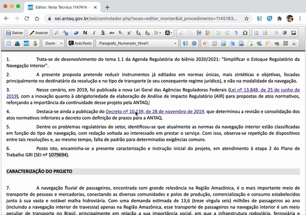

#  |  SEI Pro 

##  Abrir, editar e remover hiperlinks

No editor do SEI, clicar num link não abre o endereço, e para alterá-lo é preciso passar por uma janela de propriedades. Com o SEI Pro, **ao passar o mouse sobre um link aparece um pequeno menu** com as ações mais comuns.

> 

### As ações

| Ação | O que faz |
| ---- | --------- |
| **Abrir link** | Abre o endereço numa nova aba |
| **Copiar link** | Copia o endereço para a área de transferência |
| **Editar link** | Abre uma janela para alterar o **Texto visível** e a **URL** |
| **Remover link** | Tira o hiperlink e mantém o texto |

### Como ativar

A função vem **ligada** de fábrica. Ela fica nas [Configurações do SEI Pro](../pages/DESATIVARFUNCOES.md), aba **Geral**, seção **Editor de Texto**, opção **Abrir, editar e remover hiperlinks no editor de documentos**.

### Bom saber

* O menu aparece em links para endereços da internet (`http` e `https`). Referências a documentos do SEI e notas de rodapé têm comportamento próprio.

## Próximo item

> [Revisão de texto (controle de alterações)](../pages/REVISARDOC.md)
