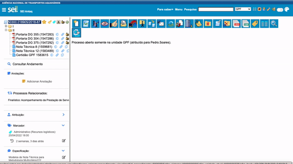

#  |  SEI Pro 

##  Ações em Lote

Essa ferramenta adiciona ao SEI a funcionalidade de dar ciência, excluir, alterar sigilo, assinar e cancelar **múltiplos** documentos dentro de um processo.

>  

As ações realizadas pela ferramenta só estarão disponíveis caso o usuário tenha acesso para fazê-las. 
Na última coluna da tabela estão vinculadas as ações disponíveis para cada documento. 

## Próximo item

> [Inserir ...](../pages/PAGE.md)
