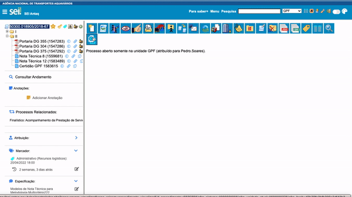

#  |  SEI Pro 

##  Ações em Lote

Reúne numa única tabela **todos os documentos do processo** e permite **assinar, dar ciência, excluir, alterar o sigilo, cancelar assinatura, duplicar e baixar vários documentos de uma vez** — em vez de abrir um por um.

> 

### Como usar

1. Abra o processo e, na barra de botões, clique em **Iniciar ações em lote**;
2. A janela **Ações em lote** lista os documentos, com número SEI, nome, quem assinou, datas, unidade e nível de acesso;
3. Marque os documentos desejados — ou use a caixa do cabeçalho para selecionar todos;
4. Clique no botão da ação, no alto da janela.

Na última coluna, **Ações**, cada documento mostra só as ações que você pode fazer nele — por exemplo, um documento já assinado por você não oferece "Assinar".

### As ações

| Ação | O que faz |
| ---- | --------- |
| **Ciência** | Registra ciência nos documentos marcados |
| **Baixar documento** | Baixa os documentos marcados |
| **Excluir** | Exclui os documentos marcados (só os que ainda podem ser excluídos) |
| **Assinar** | Assina os documentos marcados de uma vez |
| **Alterar Sigilo** | Troca o nível de acesso dos documentos marcados |
| **Cancelar Assinatura** | Cancela a sua assinatura nos documentos marcados |
| **Duplicar Documento** | Cria cópias dos documentos marcados — veja [Duplicar documentos](../pages/DUPLICARDOC.md) |

No canto direito da janela, **Baixar** e **Copiar** exportam a própria tabela (para planilha ou área de transferência), e **Pesquisar** filtra a lista.

### Como ativar

A função vem **ligada** de fábrica. Ela fica nas [Configurações do SEI Pro](../pages/DESATIVARFUNCOES.md), aba **Geral**, seção **Árvore e Visualização de Documentos**, opção **Ações em Lote**.

### Bom saber

* A ferramenta **não dá permissões novas**: cada ação só é executada nos documentos em que o SEI permitiria fazê-la à mão.
* As ações ficam registradas no SEI exatamente como se tivessem sido feitas uma a uma.
* Enquanto a lista é montada aparece o aviso *Aguarde... Pesquisando links de documentos*.

## Próximo item

> [Documentos em Lote: criar vários documentos a partir de um modelo e uma planilha](../pages/DOCUMENTOSEMLOTE.md)
