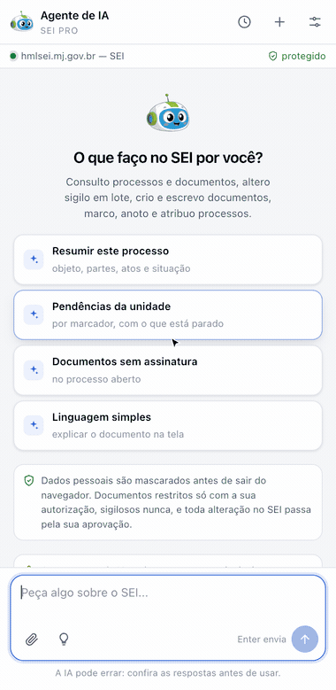
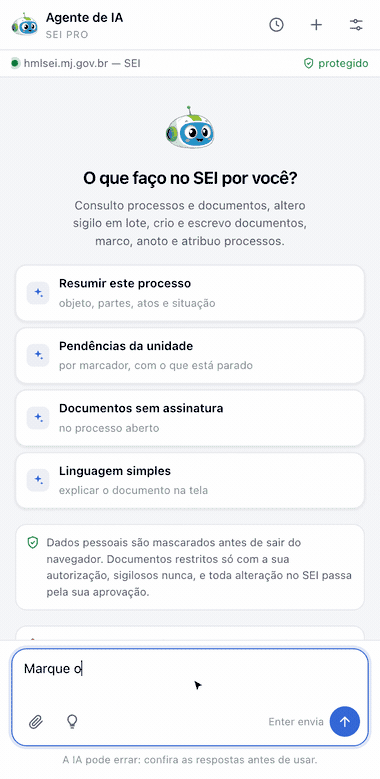
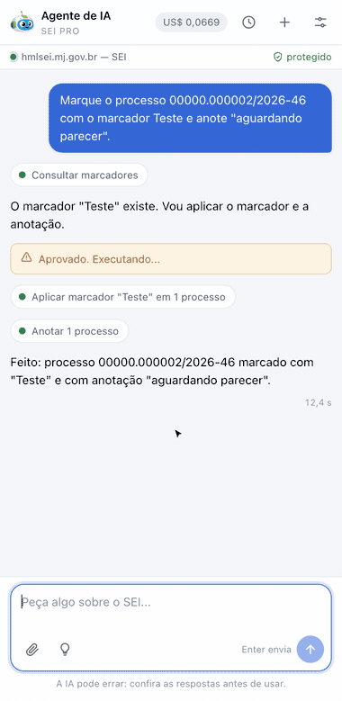

#  |  SEI Pro 

##  Agente de IA

Um agente de inteligência artificial que trabalha **dentro do SEI**, pela sua própria sessão: pergunte em português e ele consulta processos, lê documentos, resume, pesquisa — e, quando o pedido é para alterar alguma coisa, mostra antes o que vai mudar e só age depois que você aprova.

> 

> **Atenção:** as perguntas e os trechos de documentos que o agente precisa entender são enviados ao serviço de IA que **você** escolher, fora do seu órgão. Antes de usar, verifique se o seu órgão permite. O agente **nunca** atua em processos sigilosos, e documentos restritos só são lidos com a sua autorização.

### O que ele faz

| Consulta | Escrita (sempre com aprovação) |
| -------- | ------------------------------ |
| Listar a sua caixa de trabalho | Alterar tipo, especificação, interessados e nível de acesso |
| Consultar processo, árvore e histórico | Anotar, marcar, atribuir e acompanhar |
| Ler documentos, inclusive PDF | Registrar andamento, concluir e reabrir |
| Pesquisar processos e documentos do órgão | Criar documento e escrever o conteúdo |
| Ler o documento aberto no editor | Assinar, enviar para outra unidade, excluir, cancelar, dar ciência |
| Ver blocos de assinatura e internos, com o conteúdo | Criar bloco, incluir e retirar documentos, assinar o bloco inteiro, disponibilizar, retornar, concluir e reabrir |

Alguns exemplos do que dá para pedir:

* *"Resuma este processo: objeto, partes, principais atos e situação atual."*
* *"Quais documentos ainda não foram assinados?"*
* *"Explique em linguagem simples o documento que estou vendo."*
* *"Liste os processos da minha unidade agrupados por marcador e aponte os parados."*
* *"Marque este processo como urgente e anote que aguarda parecer."*
* *"Crie um Despacho encaminhando o processo à unidade X, com o texto abaixo."*
* *"Ponha os despachos que acabei de criar num bloco de assinatura e disponibilize para a unidade X."*

### Como abrir

| Onde | O que acontece |
| ---- | -------------- |
| Barra de ações da tela **Controle de Processos** | Abre o painel lateral do navegador |
| Barra de ações da **árvore do processo** | Idem, já sabendo em que processo você está |
| **Menu lateral** do SEI › Agente de IA | Acesso de qualquer tela |
| Barra do **editor de documentos** › botão de IA | Abre o painel para trabalhar sobre o documento aberto |

O agente vive num **painel lateral**, ao lado do SEI: você continua vendo o processo enquanto conversa.

### Primeiro uso

1. Abra o agente e informe a **chave de API** do serviço de IA (veja abaixo);
2. Escolha o **modelo**;
3. Clique em **Salvar e começar**.

A chave fica guardada **só neste navegador**. O SEI Pro não tem servidor: as mensagens vão do seu navegador direto para o serviço escolhido, e o SEI Pro não as vê.

#### Qual serviço de IA

| Serviço | Quando usar |
| ------- | ----------- |
| **OpenRouter** (padrão) | Caminho recomendado: um cadastro dá acesso aos modelos de vários fabricantes, com preço por modelo e custo por pergunta. O agente ainda exige que o provedor **não guarde nem treine** com o que recebe |
| **OpenAI**, **Google Gemini**, **Anthropic** | Para quem já tem conta direto com o fabricante: escolha o serviço, informe a chave e o modelo — o endereço já vem pronto |
| **Outro serviço compatível** | NVIDIA, Groq, um modelo rodando na própria máquina (Ollama) ou **um servidor do próprio órgão** — nesse caso o conteúdo não sai da rede interna |

Para o OpenRouter, crie a chave em [openrouter.ai/keys](https://openrouter.ai/keys) e adicione créditos. Nos demais, a chave é a do painel do próprio fabricante ([platform.openai.com](https://platform.openai.com/api-keys), [aistudio.google.com](https://aistudio.google.com/apikey) ou [console.anthropic.com](https://console.anthropic.com)); no serviço compatível, informe também o endereço da API (termina em `/v1`). Fora do OpenRouter, o navegador pede a sua autorização para o agente falar com aquele endereço, e o botão **Buscar modelos** preenche a lista do serviço.

> **Nem todo modelo serve.** O agente trabalha chamando ferramentas, e só parte dos modelos sabe fazer isso. No OpenRouter a lista já vem filtrada. Fora dele, se o agente conversar mas não conseguir agir no SEI, troque de modelo.

#### Avançado: controle fino e instruções suas

No fim das configurações há a seção **Avançado**, fechada por padrão — quem não mexer nela continua com os valores que o agente já usa.

| Campo | O que faz |
| ----- | --------- |
| **Temperatura** | 0 dá sempre a mesma resposta; acima de 1, mais criatividade e mais erro |
| **Top P** | Corta a cauda das palavras improváveis. Mexa nisto **ou** na temperatura, não nos dois |
| **Máximo de tokens na resposta** | Teto de tamanho da resposta; curto demais corta o texto no meio |
| **Penalidade de frequência** | Desencoraja repetir as mesmas palavras |
| **Penalidade de presença** | Empurra o modelo para assuntos novos |
| **Instruções adicionais** | Preferências suas ou da sua unidade — estilo, formato, o que sempre citar |

Campo em branco usa o padrão do serviço, e **Restaurar padrões** limpa todos. Se o modelo escolhido não aceitar um desses ajustes, o agente refaz o pedido sem ele em vez de falhar.

As instruções adicionais entram no fim das instruções do agente e valem para estilo e formato. Elas **não** dispensam a sua aprovação antes de qualquer escrita no SEI, não liberam processo sigiloso e não fazem o agente pedir senha na conversa.

### Nada é alterado sem a sua aprovação

Quando o pedido implica mexer no processo, o agente **não executa**: ele monta um cartão com o que pretende fazer, item a item, mostrando o valor de antes e o de depois. Nada acontece enquanto você não clicar em **Aprovar e executar**.

> 

* Ações **irreversíveis** — enviar processo, excluir ou cancelar documento, cancelar assinatura — exigem, além da aprovação, marcar que você entendeu que não dá para desfazer;
* **Assinar** pede o cargo e a sua senha do SEI no próprio cartão. A senha vai do painel direto para o SEI: ela **não** é enviada ao modelo de IA nem guardada;
* **Recusar** pede, opcionalmente, o que ajustar — e o agente tenta de novo com a sua correção.

### O que o agente não faz

* **Processo sigiloso:** o agente não carrega. Estando você num processo sigiloso, ele se recusa a responder qualquer coisa;
* **Documento restrito:** o conteúdo só é lido depois que você autoriza, uma vez por conversa;
* **Sua senha do SEI** nunca é enviada ao modelo;
* **Números de processo e documento** não são mascarados (o agente precisa deles), mas **dados pessoais são** — veja abaixo.

### Dados pessoais saem mascarados

Antes de qualquer texto sair do navegador, o agente troca por rótulos o que reconhece como dado pessoal: CPF, CNPJ (opcional), e-mail, telefone, CEP, RG, título de eleitor, CNH, cartão, chave PIX, data de nascimento, endereço, filiação, conta bancária e CID. O modelo recebe `[CPF_1]`, `[PESSOA_2]` — e não o dado.

Os nomes dos interessados do processo também são mascarados (dá para desligar nas configurações). Quando o agente precisa escrever algo no SEI, o dado real volta no lugar do rótulo, já dentro do seu navegador.

### Conversas guardadas

O relógio no topo do painel guarda as conversas anteriores: dá para reler, **exportar em Markdown** e apagar (uma ou todas). O prazo de guarda é configurável — 7, 30, 90 dias ou sem limite — e o recurso pode ser desligado.

> 

Fica guardada **só a transcrição** — o que apareceu na tela. O histórico enviado ao modelo e a tabela que liga os rótulos aos dados reais somem quando o navegador fecha. É por isso que uma conversa guardada abre **só para leitura**: continuar exigiria justamente o que não foi gravado.

### Quanto custa

O SEI Pro é gratuito e não cobra nada pelo agente. O custo é o do serviço de IA que você escolher, cobrado diretamente por ele. O painel mostra, no topo, quanto a conversa em curso consumiu — **em reais**, convertidos pela cotação do dia do dólar (PTAX do Banco Central; passando o mouse, aparece o valor original e a cotação usada). Nas configurações dá para desligar a conversão e ver em dólares. Quando o serviço não informa custo, o painel mostra tokens.

Uma consulta simples costuma custar centavos de dólar. Ler documentos longos custa mais, porque o texto inteiro vai para o modelo.

### Como ativar

A função vem **ligada** de fábrica. Ela fica nas [Configurações do SEI Pro](../pages/DESATIVARFUNCOES.md), aba **Geral**, seção **Editor de Texto**, opção **Agente de Inteligência Artificial**.

### Bom saber

* **A IA erra** — inclusive com aparência de certeza. Confira toda resposta antes de usar. O conteúdo de um documento assinado é de responsabilidade do agente público que o assina;
* O agente só enxerga o que **você** enxerga: ele usa a sua sessão do SEI e as suas permissões. Não há acesso a processo que você não poderia abrir;
* Toda alteração feita pelo agente entra no SEI **em seu nome**, e aparece no histórico do processo como qualquer outra;
* O agente lê PDF digitalizado com o OCR que vem na extensão, limitado às primeiras páginas. Para documentos longos, use as [Ferramentas de PDF](../pages/FERRAMENTASPDF.md);
* O SEI Pro **não intermedeia** as mensagens e não recebe financiamento de nenhum serviço de IA.

## Próximo item

> [Gerar Certidão de Documento Oficial com Sigilo (LAI e LGPD)](../pages/CERTIDAOSIGILO.md)
