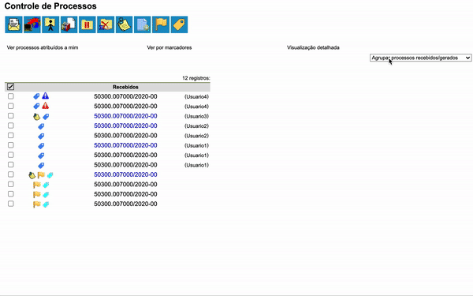

## Agrupar lista de processos por marcadores, tipo, responsável ou ponto de controle

Essa funcionalidade adiciona à página inicial do SEI agrupamento de processos por marcadores, tipo de processo, responsável ou ponto de controle.

>  
