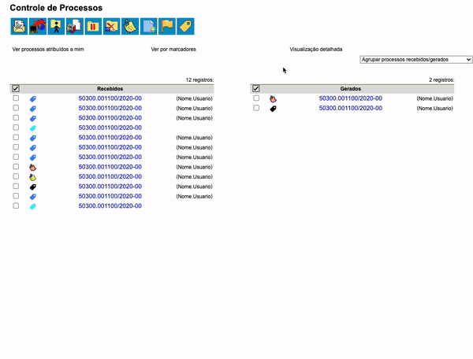

#  |  SEI Pro 

## Agrupar lista de processos por data de recebimento, autuação, envio, último acesso, marcadores, tipo, responsável, ponto de controle e unidade de envio

Essa funcionalidade adiciona à página inicial do SEI o agrupamento de processos por data de recebimento, envio, último acesso, marcadores, tipo, responsável, ponto de controle, unidade de envio ou acompanhamento especial.

>  

Ainda, é possível agrupar os processos pela **data de recebimento na unidade** e a **data do último acesso** feito por você. 

>  

Para a função **Data de recebimento, envio, autuação** e **Unidade de envio**,a extensão buscará a última data no **Histórico do Processo** que contém a descrição `Processo recebido na unidade`, `Reabertura do processo na unidade` ou `Processo público gerado` e que corresponda a sua unidade.

## Próximo item

> [Inserir documento externo (HTML e Google Docs)](./INSERIRDOC.md)
