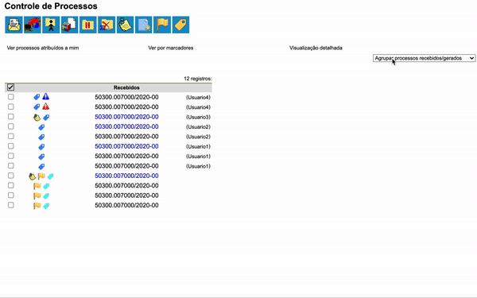
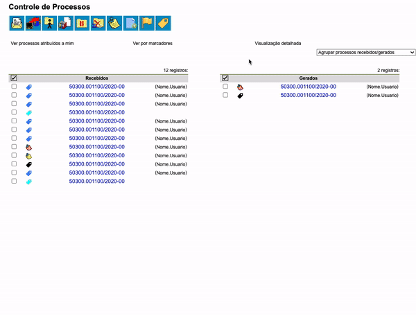

#  |  SEI Pro 

##  Agrupar, filtrar e ver os processos em quadro (Kanban)

A tela **Controle de Processos** do SEI mostra os processos numa lista única. Com o SEI Pro, você pode **separar essa lista em grupos** — por marcador, por tipo, por responsável, por prazo e outros critérios —, **filtrar** só o que interessa e ainda trocar a tabela por um **quadro de colunas** (Kanban), onde basta arrastar um processo de uma coluna para outra.

> 

### Onde fica

Logo acima das tabelas de processos recebidos e gerados aparecem três controles:

| Controle | Para que serve |
| -------- | -------------- |
| **Filtrar processos...** | Mostra só uma parte da lista |
| **Agrupar processos...** | Separa a lista em grupos |
| **Tabela / Quadro** | Alterna entre a lista e o quadro de colunas |

O ícone  ao lado do agrupamento baixa a lista em planilha — veja [Exportar informações de processos em planilha CSV](../pages/LISTAPROCESSOS.md).

### Agrupar processos

Escolha um critério na caixa **Agrupar processos...**. A lista é reorganizada na hora, com um título para cada grupo e a quantidade de processos de cada um.

| Critério | Como os processos são separados |
| -------- | ------------------------------- |
| Recebidos/gerados | Junta as duas tabelas em uma só |
| Prazo | Pelo prazo definido em [Controle de Prazos](../pages/PRAZOS.md) |
| Data de autuação | Pela data em que o processo foi criado |
| Data de recebimento | Pela data em que o processo chegou à sua unidade |
| Data de envio | Pela data em que o processo foi enviado |
| Data do último acesso | Pela última vez que **você** abriu o processo |
| Marcadores | Pelo marcador do processo |
| Tipo | Pelo tipo de processo |
| Responsável | Pela pessoa a quem o processo está atribuído |
| Ponto de controle | Pelo ponto de controle |
| Unidade de envio | Pela unidade que enviou o processo |
| Acompanhamento especial | Pelo grupo de acompanhamento especial |

Para voltar à lista normal, escolha **Sem agrupamento**. A escolha fica gravada: ao voltar à tela, o agrupamento continua o mesmo.

> 

> **Como as datas são descobertas.** O SEI não mostra as datas de recebimento, envio e autuação na lista. Para agrupar por elas, o SEI Pro consulta o **andamento** de cada processo e procura o último registro de *"Processo recebido na unidade"*, *"Reabertura do processo na unidade"* ou *"Processo público gerado"* da sua unidade. Na primeira vez isso pode levar alguns segundos, principalmente em unidades com muitos processos; depois as datas ficam guardadas no navegador.

### Filtrar processos

A caixa **Filtrar processos...** mostra apenas os processos que atendem a uma condição, sem mudar nada no SEI:

* **Processos não visualizados** — os que ainda não foram abertos (em vermelho);
* **Por atribuição** — sem atribuição, ou atribuídos a uma pessoa específica;
* **Por tipo de processo**;
* **Por marcadores** — sem marcador, ou com um marcador específico.

As opções da caixa são montadas a partir dos processos que estão na tela. Escolha **Todos os processos** para desfazer o filtro.

### Ver em quadro (Kanban)

Clique em **Quadro** para trocar a tabela por colunas lado a lado — uma coluna para cada grupo. Se nenhum agrupamento estiver escolhido, o quadro abre agrupado por **marcadores**.

**Arrastar um processo para outra coluna altera o processo no SEI:**

| Agrupamento | O que acontece ao arrastar |
| ----------- | -------------------------- |
| Marcadores | O processo recebe o marcador da coluna de destino e perde o da coluna de origem; arrastar para **Sem Grupo** só tira o marcador da coluna de origem |
| Responsável | O processo é atribuído à pessoa da coluna de destino |
| Tipo | O tipo do processo é trocado pelo da coluna de destino |

Um ícone de confirmação aparece no cartão quando o SEI termina de gravar a alteração. No quadro por marcadores, quando a alteração não pode ser feita, aparece um **X** vermelho e o processo volta para a coluna de onde saiu. Isso acontece com processo sigiloso, quando o SEI Pro não consegue abrir o processo e, no SEI 4.1 e no SEI 5, quando o SEI não confirma a gravação ou o marcador da coluna de origem já não está no processo (nesse último caso, nada é gravado).

Outros recursos do quadro:

* **Reordenar colunas** — arraste o título da coluna; a ordem fica gravada;
* **Fixar no topo** — o alfinete no cartão mantém o processo no alto da coluna;
* **Atualizar o quadro** — a lista de marcadores é relida do SEI toda vez que você abre a tela, então um marcador novo ganha a sua coluna na próxima visita. Para recarregar na hora, sem sair da tela, dê um **duplo clique** no botão **Quadro** (vale também para a lista de usuários).

Para voltar à lista, clique em **Tabela**.

### Como ativar

A função vem **ligada** de fábrica. Ela fica nas [Configurações do SEI Pro](../pages/DESATIVARFUNCOES.md), aba **Geral**, seção **Controle de Processos**, opção **Agrupar lista de processos por marcadores, tipo, responsável ou ponto de controle**.

### Bom saber

* Com a paginação do SEI ligada, o agrupamento considera apenas os processos da página atual. Para agrupar todos, ligue [Remover paginação de processos](../pages/REMOVEPAGINACAO.md).
* No agrupamento por **acompanhamento especial**, o grupo de cada processo vem da lista **Acompanhamento Especial** da sua unidade, consultada no SEI toda vez que você abre a tela. Processo acompanhado sem grupo fica em **Sem Grupo**.
* Mover um processo no quadro faz a mesma alteração que você faria pelo SEI — ela aparece para todos da unidade e fica registrada no andamento, quando o SEI registra.
* No SEI 4.1 e no SEI 5, em que um processo pode ter vários marcadores, mover o cartão no quadro por marcadores só mexe no marcador da coluna de origem e no da coluna de destino: os outros continuam no processo. O texto do marcador de origem passa para o marcador de destino; se o processo já tinha o marcador de destino, o texto dele é substituído. Como o quadro põe cada processo numa coluna só, ao recarregar a tela ele aparece na coluna de um dos marcadores que tiver.
* A especificação abaixo do número do processo ([Mostrar especificação do processo](../pages/ESPECIFICACAOPROCESSO.md)) só aparece quando não há agrupamento escolhido.

## Próximo item

> [Novos botões na barra de ações: abrir em nova aba, trocar tipo e enviar documentos em vários processos](../pages/BARRAACOES.md)
