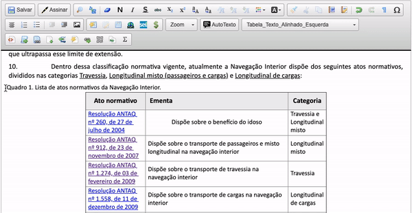

#  |  SEI Pro 

##  Alinhar o texto à esquerda, ao centro, à direita ou justificadamente

Essa funcionalidade adiciona ao editor de texto do SEI a possibilidade de alinhar o texto à esquerda, ao centro, à direita ou justificadamente

>  
