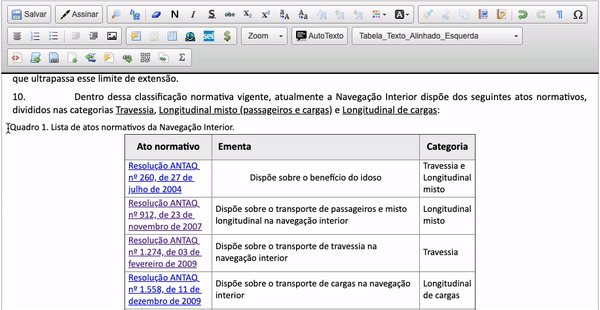

#  |  SEI Pro 

##  Alinhar o texto à esquerda, ao centro, à direita ou justificado

O editor do SEI não tem botões de alinhamento: é preciso trocar o **estilo** do parágrafo. O SEI Pro acrescenta um botão **Alinhar texto** que faz isso com um clique, **respeitando os estilos do SEI**.

> 

### Como usar

1. Selecione o parágrafo (ou vários parágrafos);
2. Na barra do editor, clique em **Alinhar texto**. Abrem-se quatro opções;
3. Escolha: **à esquerda**, **ao centro**, **à direita** ou **justificado**.

### Como funciona

Quando o parágrafo já usa um estilo do SEI da mesma família — como *Texto Alinhado à Esquerda*, *Texto Centralizado* ou os estilos de tabela e de maiúsculas —, o SEI Pro **troca pelo estilo equivalente** com o novo alinhamento. Assim o documento continua dentro do padrão de formatação do SEI. Só quando não existe estilo correspondente o alinhamento é aplicado diretamente no parágrafo.

### Como ativar

O botão aparece sempre no editor do SEI quando o SEI Pro está instalado.

## Próximo item

> [Aumentar ou reduzir o tamanho da fonte](../pages/AUMENTARFONTE.md)
