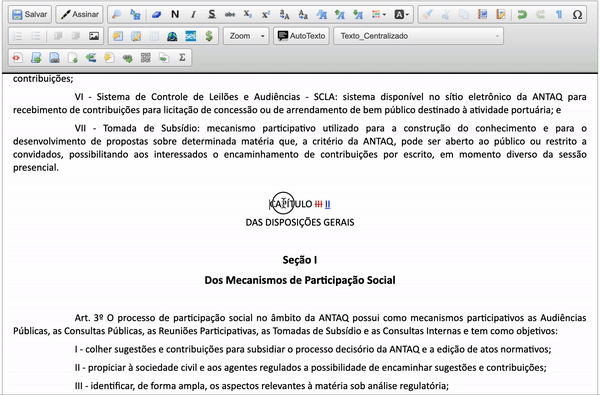

#  |  SEI Pro 

##  Aumentar ou reduzir o tamanho da fonte

Essa funcionalidade adiciona ao editor de documentos do SEI a função de aumentar ou reduzir o tamanho da fonte.

>  

O intervalo de alteração da fonte é entre `7px` e `70px`

## Próximo item

> [Alinhar o texto à esquerda, ao centro, à direita ou justificadamente](../pages/ALINHARTEXTO.md)
