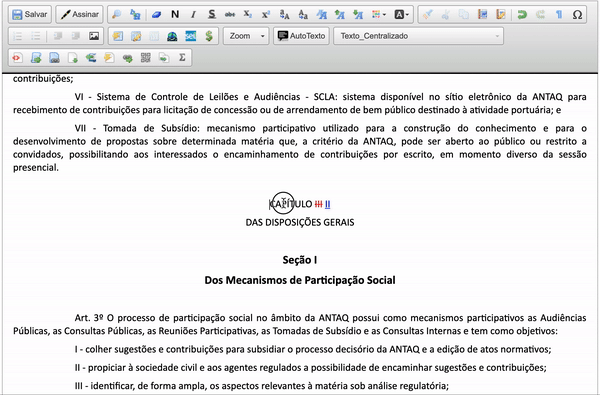

#  |  SEI Pro 

##  Aumentar ou reduzir o tamanho da fonte

Acrescenta ao editor do SEI dois botões para **aumentar** ou **diminuir** o tamanho da letra do trecho selecionado — sem precisar escolher um tamanho numa lista.

> 

### Como usar

1. Selecione o texto;
2. Clique em **Aumentar tamanho da fonte** (A↑) ou **Diminuir tamanho da fonte** (A↓);
3. Cada clique muda o tamanho em **2 pixels**. Clique quantas vezes precisar.

### Como ativar

Os botões aparecem sempre no editor do SEI quando o SEI Pro está instalado.

### Bom saber

* O tamanho fica entre **7 e 70 pixels**.
* O ajuste é aplicado ao trecho selecionado. Para padronizar parágrafos inteiros, prefira os **estilos** do SEI.

## Próximo item

> [Primeira letra maiúscula (exceto artigos e preposições)](../pages/LETRAMAIUSC.md)
