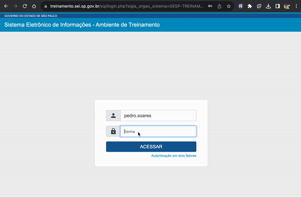

#  |  SEI Pro 

##  Autopreencher senha no login (SEI >= 4.0)

Essa funcionalidade de autopreencher senha no login do SEI (versão >= 4.0)

Devido a restrições internas de design do SEI 4.0, os navegadores não conseguem preencher automaticamente as senhas armazenadas.

Esta opção corrige a estrutura interna dos campos de login, de forma a permitir o autopreenchimento.

> 

Apesar de permitido o armazenamento de senhas no navegador, é sempre bom estabelecer algumas precauções de segurança em sua rotina de trabalho.

Veja: [É seguro salvar senhas no Google Chrome?](https://tecnoblog.net/responde/e-seguro-salvar-senhas-no-google-chrome/)

## Próximo item

> [.](../pages/.md)

