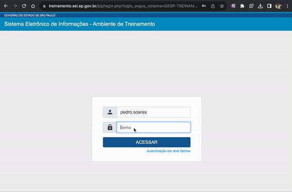

#  |  SEI Pro 

##  Autopreencher senha no login (SEI 4 e 5)

A partir da versão 4, o SEI passou a montar a tela de login de um jeito que **impede o navegador de preencher a senha salva**. Esta função ajusta os campos para que o **gerenciador de senhas do navegador volte a funcionar** — no login e também na janela de **assinatura de documentos**.

> 

### Como usar

1. Ligue a função (veja abaixo) e abra a tela de login do SEI;
2. Digite usuário e senha e entre normalmente. Se o navegador perguntar se deseja salvar a senha, aceite;
3. Nos próximos acessos, o navegador preenche a senha sozinho.

Na janela **Assinar documento**, o campo de senha também passa a aceitar o preenchimento automático.

### Como ativar

A função vem **desligada** de fábrica. Para ligar, abra as [Configurações do SEI Pro](../pages/DESATIVARFUNCOES.md), aba **Geral**, seção **Controle de Processos**, e marque **Autopreencher senha no login (SEI ≥ 4.0)**. Clique em **Salvar** e recarregue a tela de login.

### Bom saber

* O SEI Pro **não guarda nem lê a sua senha**. Quem guarda é o próprio navegador (Chrome, Edge ou Firefox); a extensão só corrige o formulário para que ele consiga fazer isso.
* No SEI 3, que não tem esse problema, a função não faz nada.
* Salvar senhas no navegador é prático, mas pede cuidado: bloqueie o computador ao se afastar e use a senha do sistema operacional. Leia: [É seguro salvar senhas no Google Chrome?](https://tecnoblog.net/responde/e-seguro-salvar-senhas-no-google-chrome/)

## Próximo item

> [Capa do processo](../pages/CAPAPROCESSO.md)
