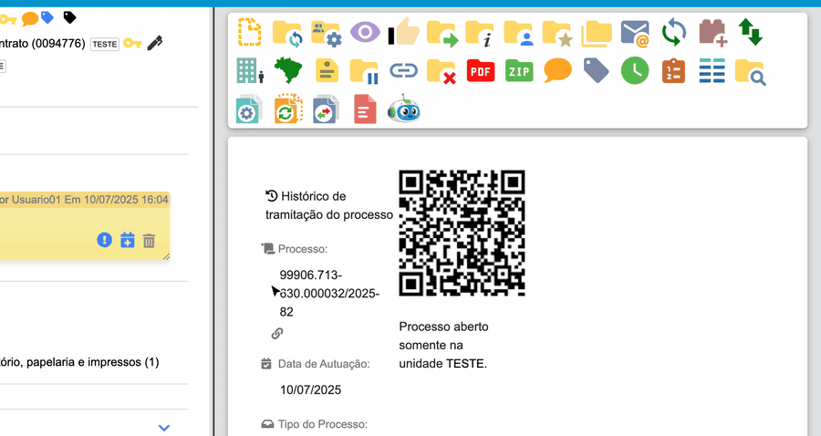

#  |  SEI Pro 

##  Abrir em nova aba e baixar documento em Word ou HTML

Os documentos gerados no SEI só podem ser vistos dentro da árvore do processo ou impressos. O SEI Pro acrescenta, no canto do visualizador, três botões para **abrir o documento em uma aba só dele** e **baixar uma cópia editável** — em **Word (.docx)** ou em **HTML**.

> 

### Os botões

Ao clicar num documento gerado no SEI, aparecem no alto, à direita do documento:

| Botão | O que faz |
| ----- | --------- |
| **Abrir documento em nova aba** | Mostra só o documento, em tela cheia, numa nova aba — bom para ler, comparar lado a lado ou imprimir |
| **Baixar documento (HTML)** | Salva o documento como página HTML, que abre em qualquer navegador |
| **Baixar documento (DOCX)** | Salva o documento como arquivo do **Word**, que abre também no LibreOffice e no Google Docs |

O arquivo recebe o nome do documento e o número SEI — por exemplo, `Despacho teste (SEI nº 0094793).docx`.

### Como ativar

Os botões aparecem sempre que o SEI Pro está instalado, nos documentos gerados no SEI.

### Bom saber

* A conversão para Word é feita **no seu computador**, dentro do navegador. O documento não é enviado a nenhum serviço de conversão.
* O Word recebe o texto com a formatação principal (negrito, centralização, maiúsculas, tabelas e imagens). Detalhes de layout muito específicos do SEI podem mudar um pouco.
* A cópia baixada é **um arquivo à parte**: alterações feitas nela não mudam o documento do SEI, e ela não leva a assinatura eletrônica. Para uma cópia com valor de original, use a versão assinada disponível no SEI (PDF do processo ou link de conferência).
* Documentos externos (PDFs e outros anexos) já têm o botão de download do próprio SEI.

## Próximo item

> [Verificar código de integridade (Hashcode)](../pages/HASHCODE.md)
