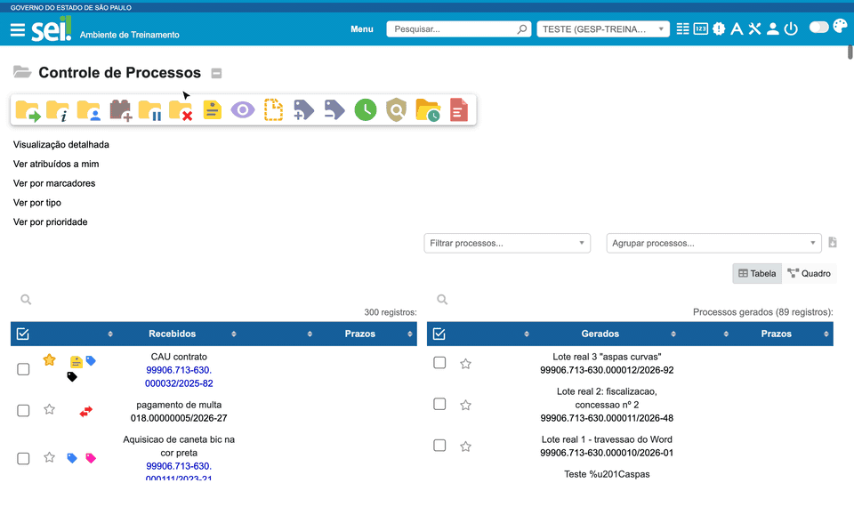

#  |  SEI Pro 

##  Novos botões na barra de ações do Controle de Processos

Ao marcar um ou mais processos na tela **Controle de Processos**, o SEI mostra a barra de ações (enviar, concluir, atribuir...). O SEI Pro acrescenta a essa barra botões para tarefas que o SEI obriga a fazer processo por processo.

> 

### Os botões

| Botão | O que faz | Depende da opção |
| ----- | --------- | ---------------- |
| **Abrir Processos em Nova Aba** | Abre cada processo marcado em uma aba própria do navegador | Sempre disponível |
| **Adicionar prazo** | Define o prazo dos processos marcados — veja [Controle de Prazos](../pages/PRAZOS.md) | Controlar Prazos |
| **Alterar informações do processo** | Troca o **tipo de processo** de todos os processos marcados de uma só vez | Controlar Prazos |
| **Enviar documentos em processos** | Envia os mesmos arquivos para todos os processos marcados — veja abaixo | Enviar Múltiplos Documentos Externos |
| **Ferramentas de PDF** | Abre as [Ferramentas de PDF](../pages/FERRAMENTASPDF.md) | Ferramentas de PDF |
| **Marcar como não visualizado** | Faz os processos voltarem a aparecer em vermelho — veja [Marcar como não visualizado](../pages/NAOLIDO.md) | Permitir marcar processos como "Não Visualizado" |
| **Reabertura Programada de Processos** | Verifica os processos agendados para reabrir — veja [Reabertura programada](../pages/REABRIRPROCESSOS.md) | Reabertura programada de processos |

Os botões que agem sobre processos só aparecem **depois que você marca pelo menos um processo**. Ferramentas de PDF e Reabertura ficam sempre visíveis.

### Enviar os mesmos arquivos para vários processos

Útil quando um mesmo documento — uma portaria, uma circular, um parecer referencial — precisa ser juntado a vários processos.

1. Marque os processos de destino;
2. Clique em **Enviar documentos em processos**;
3. Arraste os arquivos para a área que aparece acima da tabela (ou clique nela para escolher);
4. Os arquivos são enviados ao primeiro processo marcado; ao terminar, esse processo é desmarcado e o envio recomeça no seguinte, até acabar a lista.

Cada arquivo entra como **documento externo**, com as mesmas regras de [Enviar múltiplos documentos externos](../pages/UPLOADDOCS.md): o tipo é deduzido do nome do arquivo e os demais campos seguem os [valores padronizados](../pages/VALDEFAULT.md).

Para desistir antes de começar, clique em **Cancelar**.

### Trocar o tipo de vários processos

1. Marque os processos;
2. Clique em **Alterar informações do processo**;
3. Escolha o novo **Tipo de procedimento** e clique em **Alterar**.

Os processos são alterados um de cada vez; um sinal de confirmação aparece ao lado de cada um.

### Marcar vários processos com o Shift

Em qualquer tabela com caixas de seleção, **clique na primeira caixa, segure a tecla Shift e clique na última**: todas as caixas entre as duas são marcadas. Funciona em todas as telas do SEI, exceto na Pesquisa.

### Bom saber

* Para abrir várias abas, o navegador pode pedir permissão para **janelas pop-up**. Autorize para o endereço do SEI.
* Trocar o tipo e enviar documentos são alterações reais no SEI, registradas como se você as tivesse feito à mão.

## Próximo item

> [Destacar processos urgentes](../pages/URGENTE.md)
