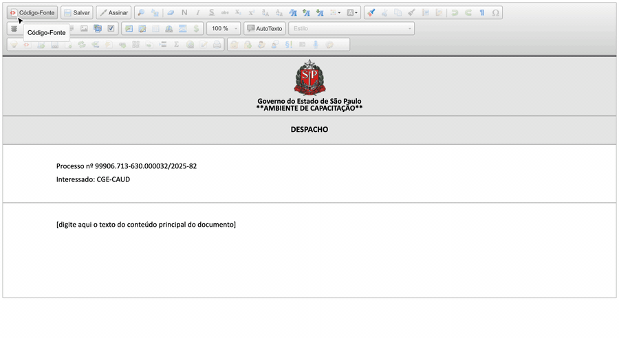

#  |  SEI Pro 

##  Inserir caixa de seleção (checklist)

Monte **listas de verificação** direto no documento do SEI — documentos conferidos, etapas cumpridas, requisitos atendidos. O SEI Pro insere um quadradinho **☐** que vira **☑** com um clique.

> 

### Como usar

1. No editor do SEI, posicione o cursor onde o item vai começar;
2. Na barra do editor, clique no botão **Inserir caixa de seleção**. O quadradinho ☐ aparece já seguido de um espaço, com o cursor depois dele;
3. Digite o texto do item e tecle Enter para ir ao próximo;
4. Repita nos outros itens;
5. Para marcar ou desmarcar, **clique no quadradinho**: ☐ vira ☑, e vice-versa;
6. Salve o documento.

### Como ativar

O botão aparece sempre no editor do SEI quando o SEI Pro está instalado.

### Bom saber

> **Problema conhecido no SEI 5.** No editor do SEI 5, a caixa é inserida normalmente, mas clicar no quadradinho ainda não troca ☐ por ☑. Por enquanto, marcar e desmarcar com um clique funciona só no SEI 4 e nas versões anteriores.

* Se a lista já está escrita, clique no **início** de cada linha e insira a caixa: o ☐ entra antes do texto, separado por um espaço.
* Marcar ou desmarcar troca **só o quadradinho**. Em documentos antigos, em que o texto do item ficou "dentro" da caixa (em negrito e maior), o texto agora é preservado ao clicar.
* O quadradinho é um caractere de texto (☐ / ☑), então aparece igual para todos, com ou sem o SEI Pro, e sai na impressão e no PDF.
* Depois que o documento é **assinado**, a lista não pode mais ser alterada — como qualquer outro conteúdo.

## Próximo item

> [Enumerar Normas (Legística)](../pages/LEGISTICA.md)
