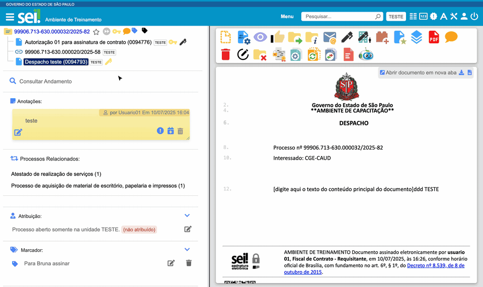

#  |  SEI Pro 

##  Capa do processo

Ao abrir um processo, o SEI mostra do lado direito só uma frase ("Processo aberto nas unidades..."). Com o SEI Pro, esse espaço vira uma **capa com o resumo do processo**: número, datas, tipo, especificação, assuntos, interessados, nível de acesso, marcador, blocos e observações — além de um **código QR** para abrir o processo no celular.

> 

### O que aparece na capa

| Informação | Detalhe |
| ---------- | ------- |
| **Processo** | Número, com botão para **copiar o link** do processo |
| **Data de Autuação** | Quando o processo foi criado |
| **Tipo do Processo** e **Especificação** | Como cadastrados no SEI |
| **Assuntos** e **Interessados** | Lista completa |
| **Nível de Acesso** | Público, restrito ou sigiloso |
| **Marcador** e **Bloco Interno** | Da sua unidade |
| **Observações** | Das unidades |
| **Código QR** | Aponte a câmera do celular para abrir o processo |
| **Histórico de tramitação do processo** | Mostra por quais unidades o processo passou, e por quanto tempo, num gráfico de linha do tempo |

A frase original do SEI, com as unidades onde o processo está aberto, continua aparecendo ao lado.

### Como usar

A capa aparece sozinha sempre que o **número do processo** está selecionado na árvore — ao abrir o processo ou ao clicar no número dele depois de ver um documento.

### Como ativar

Não há opção para ligar ou desligar: a capa aparece sempre que o SEI Pro está instalado.

### Bom saber

* O código QR leva ao endereço do processo no SEI. Quem ler o código precisa estar logado e ter acesso ao processo.
* A capa é montada com os dados que o SEI Pro lê do processo. Com a opção [Desativar consultas adicionais](../pages/DESATIVACONSULTAS.md) ligada, ela não aparece.

## Próximo item

> [Informações adicionais na árvore do processo](../pages/INFOARVORE.md)
