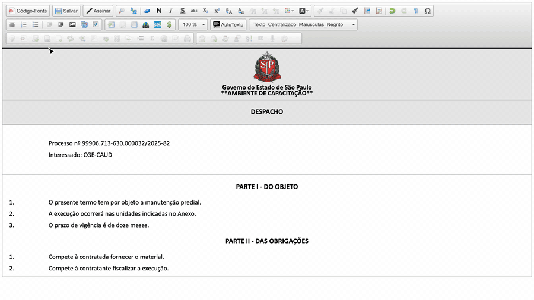

#  |  SEI Pro 

##  Imagem de fundo e configurações de página para impressão

Precisa imprimir um documento do SEI **em papel timbrado**, **em paisagem**, **com margens diferentes** ou com um **cabeçalho e rodapé** próprios? Esta ferramenta grava no documento as **configurações de página para impressão** — e, se quiser, uma **imagem de fundo** (timbre, brasão, marca d'água ou capa).

> 

### Como usar

1. No editor, clique no botão **Adicionar Imagem de Fundo e Configurações de Página para Impressão**;
2. Preencha as opções. Um **quadro de pré-visualização** mostra como a página vai ficar;
3. Clique em **OK**.

No início do documento aparece o aviso **🖨️ \* CONFIGURAÇÕES DE IMPRESSÃO** — é ele que guarda as configurações.

### As opções

| Opção | O que define |
| ----- | ------------ |
| **Importar imagem** | Imagem de fundo, em PNG, JPG ou SVG |
| **Layout** | Retrato ou paisagem |
| **Tamanho do Papel** | A5, A4, A3, Tabloid, Letter ou Legal |
| **Escala (%)** | Aumenta ou reduz o conteúdo na impressão |
| **Margens Externas** | Margem da folha, que fica em branco — inclusive sem a imagem de fundo: padrão (3 cm × 2 cm), mínima (1 cm) ou nenhuma |
| **Margens Internas** | Espaço entre a borda da área impressa e o texto, com as mesmas opções |
| **Fonte** | Fonte usada na impressão |
| **Posição da Imagem** | Topo, meio ou inferior; à esquerda, centralizada ou à direita |
| **Disposição da Imagem** | *Capa* (preenche a página) ou *Contida* (cabe inteira na página) |
| **Repetição da Imagem** | Sem repetição, horizontal, vertical, nas duas direções, entre outras |
| **Utilização da Imagem** | *Imagem de fundo* ou *Imagem como capa de livro* |
| **Texto do Cabeçalho** e **Texto do Rodapé** | Textos repetidos no alto e no pé de cada página impressa |
| **Visível apenas ao imprimir** | A imagem só aparece na impressão, não na tela |
| **Aplicar apenas na primeira página** | A imagem aparece só na primeira folha |
| **Reduzir qualidade da imagem** | Diminui o tamanho da imagem, para o documento não ficar pesado |

### Como ativar

O botão aparece sempre no editor do SEI quando o SEI Pro está instalado.

### Bom saber

* As configurações valem quando o documento é **impresso pelo navegador** (menu **Imprimir** ou `Ctrl + P`) a partir da visualização do SEI.
* Para **remover** as configurações, apague o aviso **🖨️ \* CONFIGURAÇÕES DE IMPRESSÃO** do início do documento e salve.
* Imagens grandes deixam o documento pesado. Mantenha marcada a opção **Reduzir qualidade da imagem** — veja também [Reduzir a qualidade das imagens](../pages/QUALIDADEIMAGENS.md).
* Para apenas escrever "MINUTA" ao fundo, use a [marca d'água de minuta](../pages/MARCAMINUTA.md). Para forçar uma nova página, a [quebra de página](../pages/QUEBRAPAGINA.md).

## Próximo item

> [Marca d'água de MINUTA ou MODELO](../pages/MARCAMINUTA.md)
