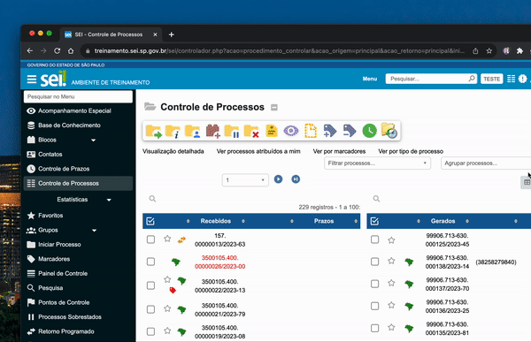

#  |  SEI Pro 

##  Contador de processos não recebidos no ícone do SEI

Essa funcionalidade adicona ao ícone do SEI no navegador um contador de processos não recebidos em sua unidade.

> 

## Próximo item

> [.](../pages/.md)
