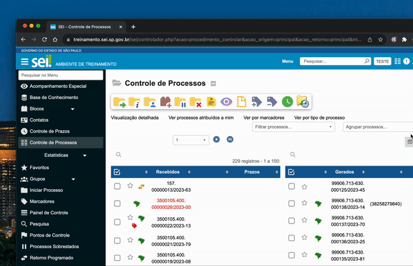

#  |  SEI Pro 

##  Contador de processos não visualizados no ícone do SEI

Mostra, **no ícone da aba do navegador**, um número com a quantidade de processos da sua unidade que ainda **não foram visualizados** — os que o SEI exibe em vermelho. Assim você sabe se chegou processo novo mesmo com a aba do SEI em segundo plano, entre várias outras abertas.

> 

### Como ativar

A função vem **ligada** de fábrica. Ela fica nas [Configurações do SEI Pro](../pages/DESATIVARFUNCOES.md), aba **Geral**, seção **Controle de Processos**, opção **Contador de processos não recebidos no ícone do SEI**.

### Bom saber

* O número é calculado **quando a tela Controle de Processos é carregada**. Ele não se atualiza sozinho: para conferir se chegou algo novo, recarregue a tela.
* Se não houver processo não visualizado, o ícone fica normal, sem número.
* Com a paginação do SEI ligada, a contagem considera só a página atual. Para contar a unidade inteira, ligue [Remover paginação de processos](../pages/REMOVEPAGINACAO.md).

## Próximo item

> [Cores personalizadas em marcadores](../pages/CORESMARCADORES.md)
