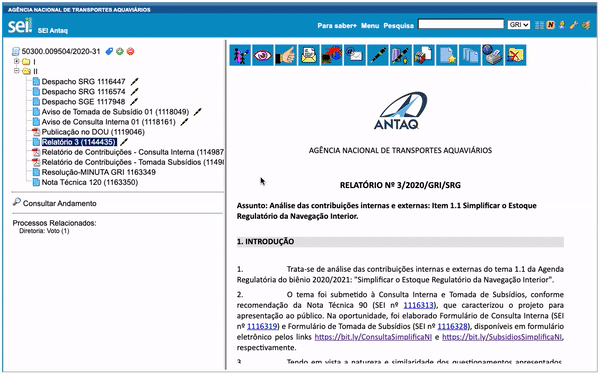

#  |  SEI Pro 

##  Copiar número, nome e link do documento

Na árvore do processo, o SEI Pro permite **copiar com um clique** o **número SEI**, o **nome** ou o **link** de um documento — inclusive já com o hiperlink, pronto para colar em outro documento do SEI.

>  

Esses atalhos fazem parte do **menu rápido** e dos **ícones rápidos** da árvore. Veja todos os detalhes em [Menu e ícones rápidos na árvore do processo](../pages/MENURAPIDO.md).

## Próximo item

> [Menu e ícones rápidos na árvore do processo](../pages/MENURAPIDO.md)
