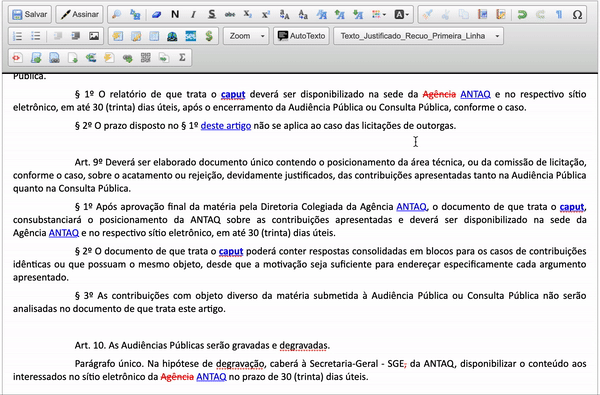

#  |  SEI Pro 

##  Copiar formatação de texto

Essa funcionalidade adiciona ao editor de documentos do SEI a função de copiar formatação de texto.

Selecione o texto que deseja copiar a formatação, clique no ícone . 

Selecione o texto de destino que você deseja formatar.

>  

Mantenha o botão `[alt]` do teclado para (`[option]` do Mac) para selecionar vários trechos do texto.

>  

## Próximo item

> [Aumentar ou reduzir o tamanho da fonte](./AUMENTARFONTE.md)
