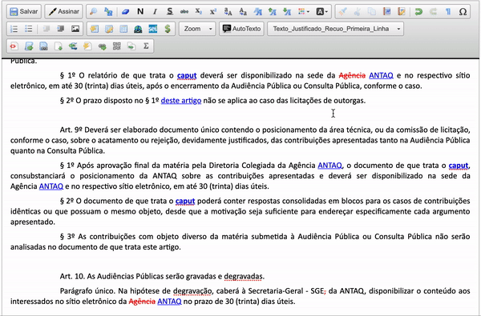

#  |  SEI Pro 

##  Copiar formatação de texto

O conhecido **pincel** dos editores de texto: copia a formatação de um trecho — cor, cor de fundo, tamanho da letra, negrito, itálico, sublinhado, tachado, subscrito e sobrescrito — e aplica em outro.

> 

### Como usar

1. Selecione o trecho que tem a formatação que você quer copiar;
2. Clique no botão **Copiar formatação** (pincel). O cursor indica que o pincel está ativo;
3. Selecione o trecho de destino: a formatação é aplicada assim que você solta o botão do mouse.

Para aplicar em **vários trechos seguidos**, mantenha a tecla `Alt` (no Mac, `Option`) pressionada enquanto seleciona cada um.

> 

A opção **Copiar formatação** também está no **menu do botão direito** do editor.

### Como ativar

O botão aparece sempre no editor do SEI quando o SEI Pro está instalado.

### Bom saber

* O pincel copia a formatação **do texto** (caracteres). O **estilo do parágrafo** (recuo, alinhamento, numeração) não é copiado — para isso, use a caixa **Estilo** do SEI.

## Próximo item

> [Teclas de atalho para os estilos do editor](../pages/TECLASATALHO.md)
