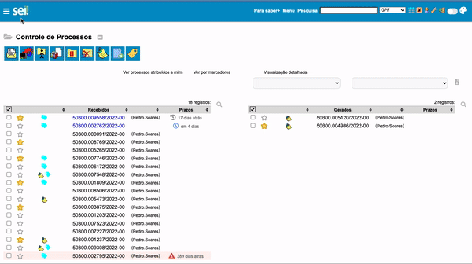

#  |  SEI Pro 

##  Permitir cores personalizadas em Marcadores

Essa ferramenta permite a seleção de cores personalizadas para os marcadores de processo no SEI.

>  

## Próximo item

> [Inserir ...](../pages/PAGE.md)
