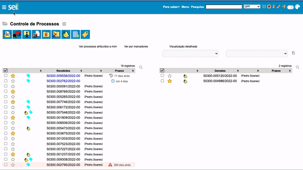

#  |  SEI Pro 

##  Permitir cores personalizadas em Marcadores

O SEI oferece um número limitado de cores para os marcadores de processo. Com o SEI Pro, **você escolhe qualquer cor** — útil quando a unidade usa muitos marcadores e as cores padrão começam a se repetir.

> 

### Como usar

1. No menu do SEI, abra **Marcadores** e clique em **Novo** (ou em **Alterar** num marcador existente);
2. Ao lado do nome aparece o campo **Cor Personalizada**. Clique nele e escolha a cor;
3. O código da cor (por exemplo, `#e67e22`) é acrescentado ao final do nome do marcador;
4. Clique em **Salvar**.

A partir daí, o marcador aparece com a cor escolhida na tela Controle de Processos, na árvore do processo e nos painéis do SEI Pro.

### Como ativar

A função vem **ligada** de fábrica. Ela fica nas [Configurações do SEI Pro](../pages/DESATIVARFUNCOES.md), aba **Geral**, seção **Controle de Processos**, opção **Permitir cores personalizadas em Marcadores**.

### Bom saber

* **A cor fica gravada no nome do marcador.** Por isso ela vale para todos da unidade que usam o SEI Pro. Quem não usa a extensão vê o marcador com a cor padrão do SEI e o código da cor no final do nome — algo como `Urgente #e67e22`.
* Para trocar a cor, basta alterar o marcador e escolher outra: o código antigo é substituído.
* Para voltar à cor padrão, apague o código do final do nome.

## Próximo item

> [Histórico de processos visitados](../pages/HISTORICOPROC.md)
