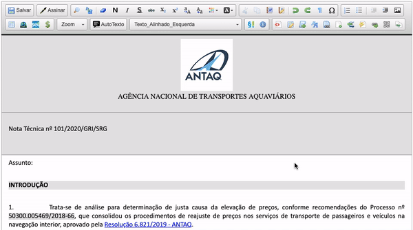

#  |  SEI Pro 

##  Inserir dados do processo

Essa funcionalidade adiciona ao editor de texto do SEI a inserção de dados do processo

>  

Atualmente estão disponíveis os seguintes parâmetros: 

|  Dados do Processo  |
| ------------------- | 
|  Número do Proceso |
|  Tipo de Processo |
|  Descrição |
|  Interessados |
|  Assuntos |
|  Data de hoje |

## Próximo passo

> [Gerar link curto do TinyUrl](./LINKCURTO.md)
