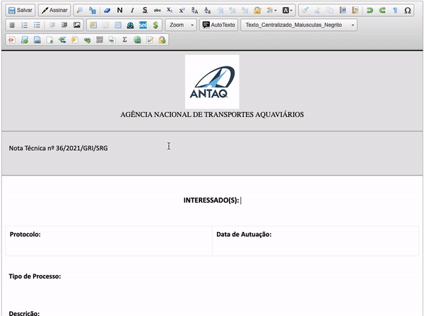
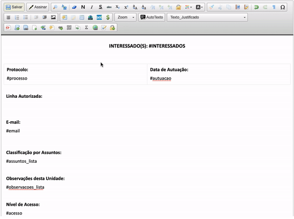
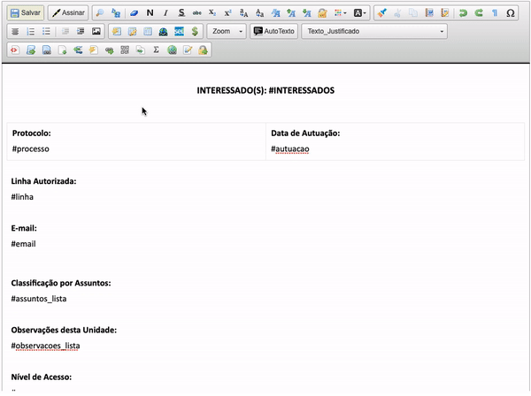

#  |  SEI Pro 

##  Inserir dados do processo

Essa funcionalidade adiciona ao editor de texto do SEI a inserção de dados do processo

>  

Atualmente estão disponíveis os seguintes parâmetros: 

|  Dados do Processo  |
| ------------------- | 
|  Número do Proceso |
|  Data de Autuação |
|  Tipo de Processo |
|  Especificação |
|  Interessados |
|  Assuntos |
|  Observações |
| Campos personalizados |
|  Data de hoje |

### Substituir campos dinâmicos

Além da inserção manual de dados do processo, é possível substituir campos dinâmicos no documento (iniciados por #) pelas informações do processo.

>  

Atualmente, é possível utilizar os seguintes campos dinâmicos:

|  Campo dinâmico  | Informação do processo |
| ------------------- | ------------------- | 
| `#processo`  |  Número do processo _(com link)_ |
| `#processo_texto`  |  Número do processo _(sem link)_ |
| `#autuacao`  |  Data de autuação do processo _(em formato DD/MM/AAAA)_ |
| `#tipo`  |  Tipo do processo |
| `#especificacao`  |  Especificação do processo |
| `#assuntos`  |  Classificação por assuntos do processo _(separados por vírgula)_ |
| `#assuntos_lista`  |  Classificação por assuntos do processo _(em formato de lista)_ |
| `#interessados`  |  Interessados do processo _(separados por vírgula)_ |
| `#interessados_lista`  |  Interessados do processo _(em formato de lista)_ |
| `#observacoes`  |  Observações do processo _(separados por vírgula)_ |
| `#observacoes_lista`  |  Observações do processo _(em formato de lista)_ |
| `#observacao`  |  Observação da unidade atual |
| `#acesso`  |  Nível de acesso do processo |
| `#acesso_texto`  |  Nível de acesso do processo _(sem ícone)_ |
| `#documentos`  |  Lista de todos os documentos do processo _(separados por vírgula)_ |
| `#documentos_lista`  |  Lista de todos os documentos do processo _(em formato de lista)_ |
| `#hoje`  |  Data de hoje _(em formato [dia] de [mês] de [ano])_ |

Funções Avançadas. Adicione um numerador ao final do campo dinâmico para retornar um registro específico.

|  Campo dinâmico  | Informação do processo |
| ------------------- | ------------------- | 
| `#assunto1`  |  Primeiro assunto do processo |
| `#assunto3`  |  Terceiro assunto do processo |
| `#interessado1`  |  Primeiro interessado do processo |
| `#interessado4`  |  Quarto interessado do processo |
| `#observacao1`  |  Primeira observação do processo |
| `#observacao2`  |  Segunda observação do processo |
| `#documento1`  |  Primeiro documento do processo |
| `#documento5`  |  Quinto documento do processo |
| `#documento+1`  |  Próximo documento do processo em relação ao atual |
| `#documento+3`  |  Terceiro documento do processo em relação ao atual |
| `#documento-1`  |  Primeiro documento do processo anterior ao atual |
| `#documento-6`  |  Sexto documento do processo anterior ao atual |
| `#hoje+1`  |  Amanhã _(em formato [dia] de [mês] de [ano])_ |
| `#hoje-1`  |  Ontem _(em formato [dia] de [mês] de [ano])_ |
| `#hoje+7`  |  Data daqui 7 dias _(em formato [dia] de [mês] de [ano])_ |
| `#hoje-5`  |  Data à 5 dias atrás _(em formato [dia] de [mês] de [ano])_ |

### Campos dinâmicos personalizados

É possível personalizar os campos dinâmicos com informações específicas do processo.
Para isso, adicione um nome de campo personalizado e seu valor correspondente.

>  

Os campos dinâmicos personalizados podem ser utilizados em qualquer documento do processo. Para tanto, as informações dessa ferramenta são salvas nas observações da unidade para este processo.

>  

Os campos dinâmicos personalizados poderão ser utilizados por outras unidades, apesar de não disponíveis para edição.

## Próximo item

> [Gerar link curto do TinyUrl](./LINKCURTO.md)
