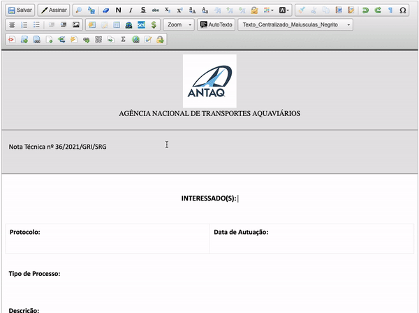
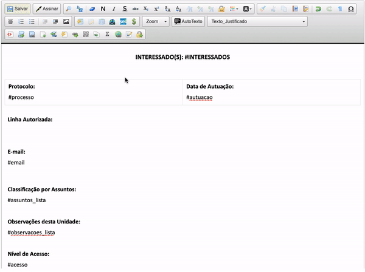
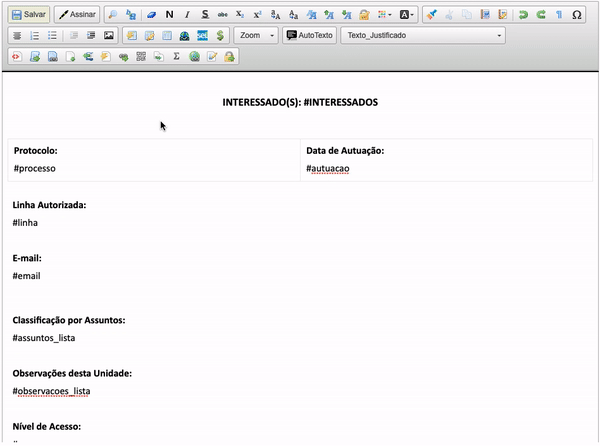

#  |  SEI Pro 

##  Inserir dados do processo e campos dinâmicos

Pare de copiar número de processo, interessados e assuntos de uma tela para outra. No editor do SEI, o SEI Pro **insere os dados do processo com um clique** — e ainda troca **campos dinâmicos** (como `#processo` e `#interessados`) pelas informações reais, o que permite criar **modelos de documento** que se preenchem sozinhos.

> 

### Como abrir

No editor, clique no botão **Inserir dados do processo**. A janela tem quatro abas:

| Aba | Para que serve |
| --- | -------------- |
| **Dados do Processo** | Escolher uma informação e inseri-la onde está o cursor |
| **Substituir Campos Dinâmicos** | Trocar todos os campos `#...` do texto pelos dados do processo |
| **Campos Dinâmicos Personalizados** | Criar campos próprios para o processo |
| **Lista de Campos Dinâmicos** | Consultar todos os campos disponíveis |

### Inserir um dado

1. Clique no texto onde a informação deve entrar;
2. Na aba **Dados do Processo**, escolha a informação — número, data de autuação, tipo, especificação, nível de acesso, interessados, assuntos, observações, QR Code do processo, campos personalizados ou a data de hoje;
3. Clique em **Inserir**.

### Substituir campos dinâmicos

Escreva no documento (ou num modelo) os campos abaixo e, na aba **Substituir Campos Dinâmicos**, clique em **Substituir**: cada campo é trocado pela informação correspondente.

> 

| Campo dinâmico | Informação do processo |
| -------------- | ---------------------- |
| `#processo` | Número do processo _(com link)_ |
| `#processo_texto` | Número do processo _(sem link)_ |
| `#autuacao` | Data de autuação _(DD/MM/AAAA)_ |
| `#tipo` | Tipo do processo |
| `#especificacao` | Especificação do processo |
| `#assuntos` | Assuntos _(separados por vírgula)_ |
| `#assuntos_lista` | Assuntos _(em lista)_ |
| `#interessados` | Interessados _(separados por vírgula)_ |
| `#interessados_lista` | Interessados _(em lista)_ |
| `#observacoes` | Observações das unidades _(separadas por vírgula)_ |
| `#observacoes_lista` | Observações das unidades _(em lista)_ |
| `#observacao` | Observação da unidade atual |
| `#acesso` | Nível de acesso _(com ícone)_ |
| `#acesso_texto` | Nível de acesso _(só o texto)_ |
| `#documentos` | Todos os documentos do processo _(separados por vírgula)_ |
| `#documentos_lista` | Todos os documentos do processo _(em lista)_ |
| `#totaldocumentos` | Quantidade de documentos do processo |
| `#hoje` | Data de hoje _(por extenso: 12 de setembro de 2026)_ |
| `#ano` | Ano atual _(AAAA)_ |
| `#qrcode` | QR Code com o link do processo |

#### Funções avançadas

Acrescente um número ao campo para pegar um item específico, ou some e subtraia dias e documentos:

| Campo dinâmico | Resultado |
| -------------- | --------- |
| `#assunto1`, `#assunto3` | Primeiro, terceiro assunto |
| `#interessado1`, `#interessado4` | Primeiro, quarto interessado |
| `#observacao1`, `#observacao2` | Primeira, segunda observação |
| `#documento1`, `#documento5` | Primeiro, quinto documento do processo |
| `#documento+1`, `#documento+3` | Um, três documentos **depois** do atual |
| `#documento-1`, `#documento-6` | Um, seis documentos **antes** do atual |
| `#documento-ultimo` | Último documento do processo |
| `#hoje+1`, `#hoje+7` | Amanhã, daqui a 7 dias _(por extenso)_ |
| `#hoje-1`, `#hoje-5` | Ontem, 5 dias atrás _(por extenso)_ |

### Campos dinâmicos personalizados

Crie campos com informações específicas do processo — por exemplo `#contrato` = *nº 12/2026* ou `#empresa` = *Construtora Exemplo Ltda.*:

1. Na aba **Campos Dinâmicos Personalizados**, informe o **nome** (sem acentos nem espaços) e o **valor**;
2. Clique em **Salvar**.

> 

A partir daí, `#contrato` pode ser usado em **qualquer documento do processo**, tanto na substituição quanto na inserção.

> 

### Como ativar

O botão aparece sempre no editor do SEI quando o SEI Pro está instalado, em documentos de processos.

### Bom saber

* Os campos personalizados são gravados nas **observações da sua unidade** para aquele processo. Outras unidades conseguem usá-los na substituição, mas não podem editá-los.
* Os dados vêm do processo no momento da inserção. Se o processo mudar depois (um novo interessado, por exemplo), substitua ou insira de novo.
* A mesma lista aparece ao digitar `#` no texto, com a [escrita interativa](../pages/ESCRITAINTERATIVA.md).
* Para criar muitos documentos a partir de um modelo e de uma planilha, veja [Documentos em Lote](../pages/DOCUMENTOSEMLOTE.md).

## Próximo item

> [Inserir referência de documentos do processo](../pages/REFDOCUMENTOS.md)
