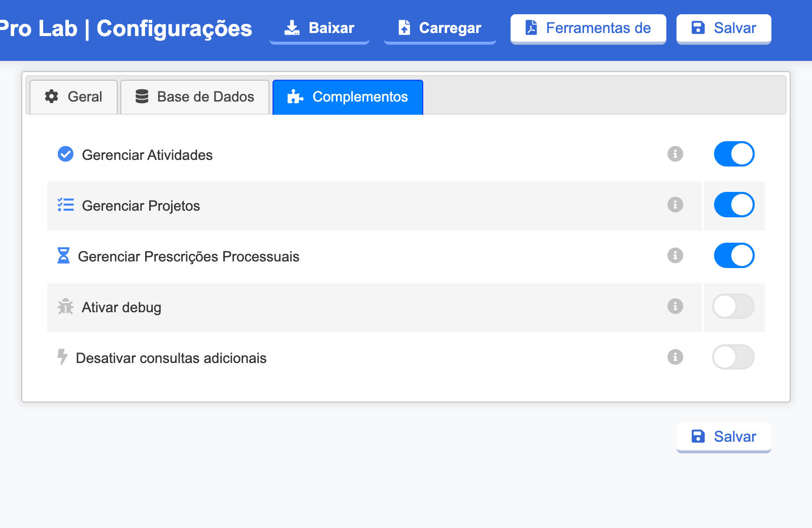

#  |  SEI Pro 

##  Desativar consultas adicionais

Várias funções do SEI Pro mostram informações que o SEI não exibe na tela — a capa do processo, o painel ao lado da árvore, as datas de recebimento, o histórico de processos visitados. Para montá-las, a extensão faz **consultas adicionais ao SEI em segundo plano**, lendo os dados do processo como se você tivesse aberto as telas correspondentes.

Esta opção **desliga essas consultas**. O SEI Pro fica mais leve, faz menos pedidos ao servidor do SEI — e, em troca, as funções que dependem delas deixam de aparecer.

> 

### Quando usar

* Quando a **área de tecnologia do seu órgão** pedir, para reduzir a carga no servidor do SEI;
* Em conexões lentas, se o SEI ficar lento ao abrir processos;
* Para descobrir se um problema tem relação com essas consultas, ao investigar um erro.

### Como ativar

A opção vem **desligada** de fábrica. Para ligar, abra as [Configurações do SEI Pro](../pages/DESATIVARFUNCOES.md), aba **Complementos**, e marque **Desativar consultas adicionais**. Clique em **Salvar** e recarregue o SEI.

Com a opção ligada, aparece abaixo da árvore do processo o aviso **Bloqueada consultas adicionais**. Clique nele para **reativar** as consultas sem abrir as configurações.

### O que deixa de funcionar

Com as consultas desligadas, não são carregados:

* a [Capa do processo](../pages/CAPAPROCESSO.md);
* as [Informações adicionais na árvore do processo](../pages/INFOARVORE.md);
* o [Histórico de processos visitados](../pages/HISTORICOPROC.md) (novos acessos não são registrados);
* o [título da aba com o número do processo](../pages/TITULOPAGINA.md) e o [endereço amigável](../pages/URLAMIGAVEL.md);
* os [campos dinâmicos e dados do processo no editor](../pages/DADOSPROCESSO.md);
* os botões de [Ações em Lote](../pages/ACOESEMLOTE.md) e [Documentos em Lote](../pages/DOCUMENTOSEMLOTE.md) na barra do processo;
* a troca rápida de unidade pela [caixa de seleção](../pages/SUBSTITUIRSELECAO.md).

As demais funções continuam normais.

### Bom saber

* Em alguns órgãos, a pedido da área de tecnologia, as consultas adicionais podem vir **bloqueadas de fábrica**. Nesse caso, o aviso **Bloqueada consultas adicionais** aparece mesmo sem você ter marcado a opção.
* As consultas usam o seu próprio acesso ao SEI: elas só leem o que você já poderia ver abrindo as telas à mão.

## Próximo item

> [Ativar debug (diagnóstico de problemas)](../pages/DEBUGPAGE.md)
