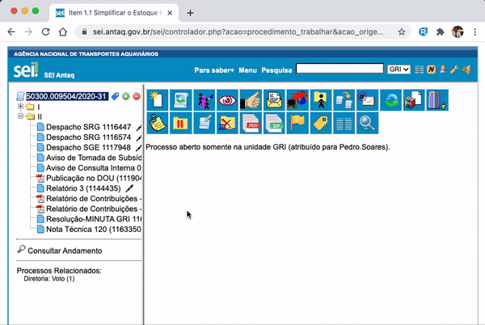

#  |  SEI Pro 

##  Desativar funções da extensão 

Você ainda pode desativar funções da extensão que não deseja utilizar.

>  

Para isso, acesse as opções da extensão clicando com o botão direito sobre o ícone do **SEI Pro** na barra de extensões do Google Chrome:

>  

Caso o ícone não esteja visível, fixe-a na barra de extensões.

>  

Ou cole o link na barra de endereços do navegador:

> `chrome://extensions/?options=cnkocjlifhcemdapiomhehhmjmlmmgem`

Na aba **Geral**, deslize para a esquerda os itens que deseja desativar da extensão. Clique em **Salvar** e **Recarregue** a página do SEI.
