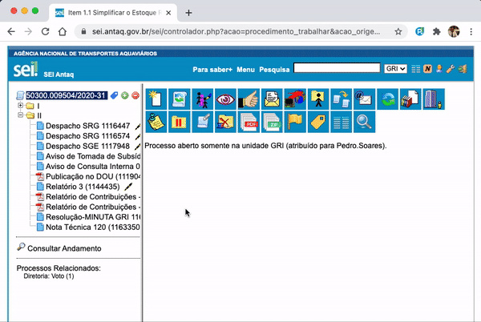

#  |  SEI Pro 

##  Configurações do SEI Pro: ligar e desligar funções

Quase todas as funções do SEI Pro podem ser **ligadas ou desligadas**. Assim você deixa só o que usa e adapta a extensão ao seu jeito de trabalhar.

> 

### Como abrir as configurações

* Clique no ícone do **SEI Pro** na barra de extensões do navegador (ao lado da barra de endereços). As configurações abrem na hora;
* Se o ícone não estiver visível, clique no ícone de **peça de quebra-cabeça** (Extensões) e depois no **alfinete** ao lado do SEI Pro, para fixá-lo na barra;
* Outra forma: clique com o botão direito no ícone do SEI Pro e escolha **Opções**.

>  

### Como ligar ou desligar uma função

1. Na aba **Geral**, abra a seção desejada — **Controle de Processos**, **Editor de Texto** ou **Árvore e Visualização de Documentos**;
2. Deslize a chave ao lado da função: **azul** é ligada, **cinza** é desligada;
3. Clique em **Salvar**, no alto da página;
4. **Recarregue a página do SEI** (tecla `F5`) para a mudança valer.

O ícone **(i)** ao lado de cada função abre a página de ajuda correspondente.

Algumas funções têm opções extras, que aparecem logo abaixo delas quando são ligadas — por exemplo, o intervalo da [reabertura programada](../pages/REABRIRPROCESSOS.md) e os [valores padronizados](../pages/VALDEFAULT.md).

### As abas

| Aba | Conteúdo |
| --- | -------- |
| **Geral** | As funções do dia a dia, organizadas em três seções |
| **Base de Dados** | Conexões com serviços externos: chaves de [inteligência artificial](../pages/FERRAMENTASIA.md) e servidores institucionais (módulo Atividades) |
| **Complementos** | Funções institucionais e de diagnóstico: [Atividades](https://bit.ly/Guia-SEI-Pro-Atividades), [Projetos](../pages/PROJETOS.md), [Prescrições](../pages/PRESCRICOES.md), [Ativar debug](../pages/DEBUGPAGE.md) e [Desativar consultas adicionais](../pages/DESATIVACONSULTAS.md) |

### Guardar e levar suas configurações

No alto da página:

* **Baixar Configurações** salva todas as suas escolhas num arquivo `config.json`;
* **Carregar Configurações** aplica um arquivo salvo antes.

Use para fazer uma cópia de segurança, levar a configuração para outro computador ou distribuir uma configuração padrão para a equipe.

> **Cuidado:** o arquivo inclui as chaves de acesso cadastradas na aba **Base de Dados** (por exemplo, a chave de API da inteligência artificial). Não compartilhe um arquivo que contenha chaves pessoais.

O botão **Ferramentas de PDF** também fica aqui — veja [Ferramentas de PDF](../pages/FERRAMENTASPDF.md).

### Opções que dependem do SEI

A página de configurações roda separada do SEI e não enxerga os dados do seu órgão. Por isso, opções que precisam de uma lista do SEI são definidas **de dentro do SEI**.

É o caso da **hipótese legal padrão** para novos documentos. Se a caixa **Hipótese legal do documento** aparece vazia nas configurações, isso é esperado. Para definir:

1. No SEI, abra um documento e clique em **Consultar/Alterar Documento**;
2. Em **Nível de Acesso**, marque **Restrito**;
3. Escolha a **hipótese legal** desejada;
4. Clique em **Definir como padrão para novos documentos**, ao lado do rótulo *Hipótese Legal*;
5. Aparece a mensagem *Padrão de sigilo definido com sucesso!*.

A partir daí, os novos documentos já nascem restritos com essa hipótese — veja [Valores padronizados](../pages/VALDEFAULT.md).

### Bom saber

* As configurações ficam guardadas **no navegador**. Se você usa o Chrome sincronizado com a sua conta, elas acompanham você em outros computadores.
* Desinstalar a extensão apaga as configurações. Baixe uma cópia antes.
* Uma função desligada não faz nada: ela não carrega e não consulta o SEI.

## Próximo item

> [Desativar consultas adicionais](../pages/DESATIVACONSULTAS.md)
