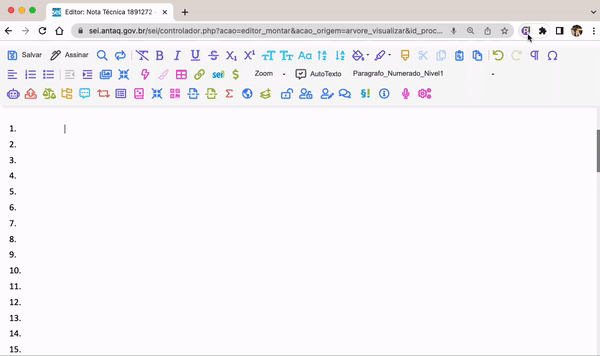

#  |  SEI Pro 

##  Ditado no editor de documentos

Essa funcionalidade habilito o ditado de frases no editor de documentos do SEI.

> 

A ferramenta utiliza a tecnologia nativa do navegador para interpretar o áudio do seu microfone e transcrevê-lo em texto.
Nenhum dado é trafegado externamente. Todo processamento de áudio é feito localmente pelo navegador.

## Próximo item

> [.](../pages/.md)
