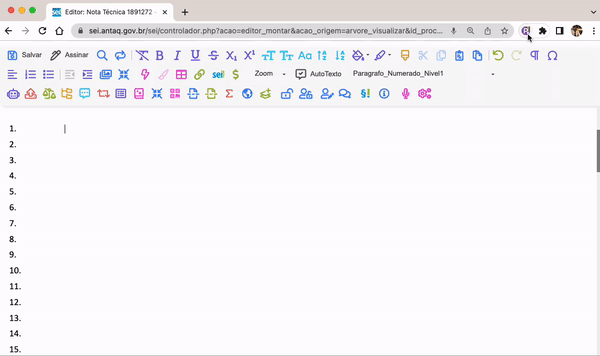

#  |  SEI Pro 

##  Ditado no editor de documentos

**Fale e o texto aparece** no documento. O ditado usa o reconhecimento de voz do próprio navegador para transcrever o que você diz no microfone.

> 

### Como usar

1. No editor, clique no ponto onde o texto deve entrar;
2. Clique no botão **Ativar ditado de texto** (microfone). Na primeira vez, o navegador pede **permissão para usar o microfone** — autorize;
3. Fale normalmente. O texto é escrito conforme você fala;
4. Clique de novo no microfone para parar.

### Configurações

Em **Gerenciar configurações do ditado** você escolhe o **idioma** e a **variante regional** (por exemplo, Português — Brasil). A janela também mostra o **atalho de teclado** para ligar e desligar o ditado.

### Como ativar

A função vem **ligada** de fábrica. Ela fica nas [Configurações do SEI Pro](../pages/DESATIVARFUNCOES.md), aba **Geral**, seção **Editor de Texto**, opção **Ditado no editor de documentos**.

### Bom saber

* O ditado usa o **reconhecimento de voz do navegador**. No Chrome e no Edge, o áudio é enviado ao serviço de reconhecimento de voz do fabricante do navegador (Google ou Microsoft) para ser transcrito. O SEI Pro não recebe nem guarda o áudio. Não dite informações sigilosas.
* Funciona melhor no **Chrome** e no **Edge**. O Firefox não tem reconhecimento de voz.
* A pontuação nem sempre é reconhecida. **Sempre revise o texto.**
* Um microfone de fone de ouvido, num ambiente silencioso, melhora muito o resultado.

## Próximo item

> [Escrita interativa (digite # ou @)](../pages/ESCRITAINTERATIVA.md)
