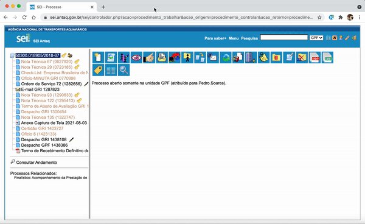

#  |  ANTAQ Pro 

##   Dividir as informações do documento na árvore do processo em duas linhas

Essa funcionalidade divide as informações do documento na árvore do processo em duas linhas

>   

## Próximo item

> [Redimensionar automaticamente a árvore do processo pela sua largura total](../pages/RESIZEARVORE.md)
