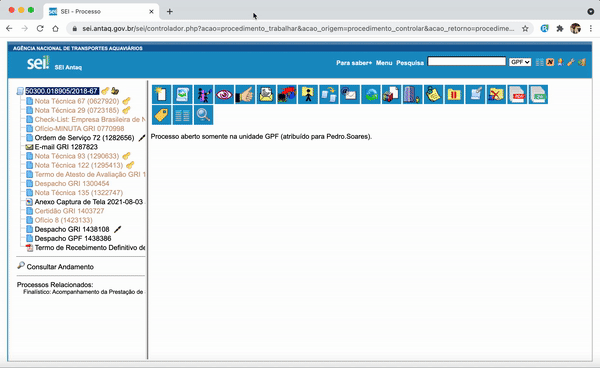

#  |  SEI Pro 

##  Dividir as informações do documento na árvore do processo em duas linhas

Na árvore do SEI, cada documento ocupa uma linha com o nome, o número SEI e os ícones — e, com nomes longos, o texto é cortado ou empurra a árvore para os lados. Esta função **quebra cada documento em duas linhas**: o nome em cima e o **número SEI** embaixo, junto com os ícones.

> 

### Como ativar

A função vem **desligada** de fábrica. Para ligar, abra as [Configurações do SEI Pro](../pages/DESATIVARFUNCOES.md), aba **Geral**, seção **Árvore e Visualização de Documentos**, e marque **Dividir as informações do documento na árvore do processo em duas linhas**. Clique em **Salvar** e recarregue o processo.

### Bom saber

* A árvore fica mais alta, mas bem mais fácil de ler — principalmente em processos com nomes de documentos longos.
* Combina com [Numerar documentos na árvore](../pages/NUMERARDOCSARVORE.md) e com os [ícones rápidos](../pages/MENURAPIDO.md), que passam para a segunda linha.
* Funciona também em processos com documentos divididos em pastas.

## Próximo item

> [Redimensionar automaticamente a árvore do processo](../pages/RESIZEARVORE.md)
