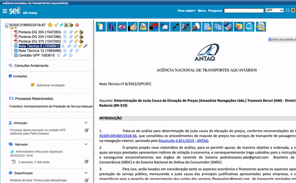

#  |  SEI Pro 

##  Alertar sobre documentos não assinados ao enviar um processo

Essa ferramenta alerta ao usuário sobre documentos não assinados naquela unidade ao enviar um processo.

>  

## Próximo item

> [Permitir cores personalizadas em Marcadores](../pages/CORESMARCADORES.md)
