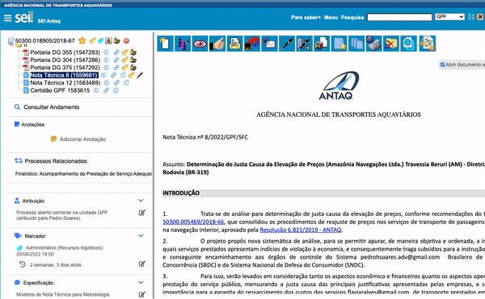

#  |  SEI Pro 

##  Alertar sobre documentos não assinados ao enviar um processo

É comum enviar um processo e só depois perceber que um documento da unidade ficou sem assinatura. Com esta função, ao abrir a tela **Enviar Processo**, o SEI Pro **confere os documentos da sua unidade** e avisa se algum ainda não foi assinado — antes de o processo sair.

> 

### Como funciona

Ao abrir **Enviar Processo**, aparece no alto do formulário uma das mensagens:

| Mensagem | Significado |
| -------- | ----------- |
| *Verificando documentos não assinados na unidade...* | A conferência está em andamento |
| *Todos os documentos foram assinados na unidade* | Pode enviar |
| *Existem documentos não assinados na unidade* | Há pendência. Clique em **Detalhes** para ver a lista |
| *Não foi possível verificar...* | A consulta falhou. Clique em **Tentar novamente** |

Quando há pendência, a lista de documentos sem assinatura abre sozinha.

### Opções extras no envio

Na mesma tela, o SEI Pro acrescenta caixas para fazer, junto com o envio:

* **Remover marcadores** do processo na sua unidade;
* **Remover atribuição**;
* **Reabrir processo em data certa** — veja [Reabertura programada](../pages/REABRIRPROCESSOS.md) (quando essa opção está ligada).

### Como ativar

A função vem **ligada** de fábrica. Ela fica nas [Configurações do SEI Pro](../pages/DESATIVARFUNCOES.md), aba **Geral**, seção **Árvore e Visualização de Documentos**, opção **Alertar sobre documentos não assinados ao enviar um processo**.

### Bom saber

* São conferidos apenas os documentos **gerados no SEI** (não os externos) e **criados pela sua unidade**.
* O aviso não impede o envio: a decisão continua sendo sua.
* Em processos com muitos documentos, a conferência pode levar alguns segundos.

## Próximo item

> [Numerar documentos na árvore do processo](../pages/NUMERARDOCSARVORE.md)
