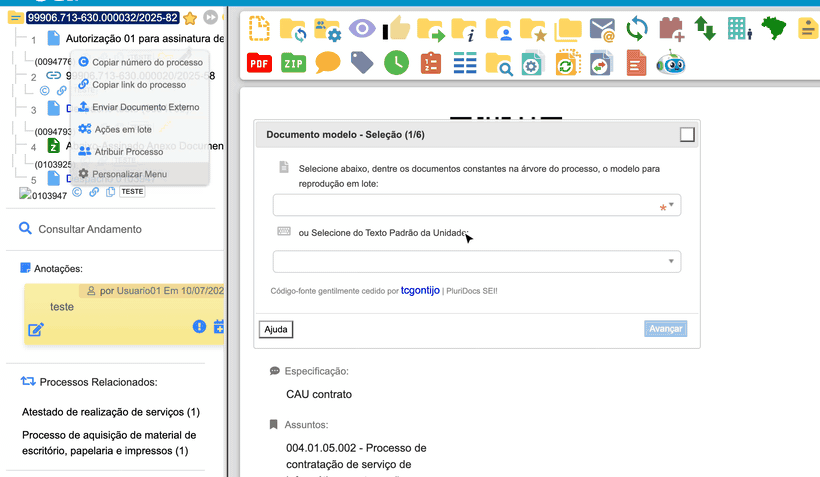

#  |  SEI Pro 

##  Documentos em Lote

Cria **vários documentos de uma vez** a partir de um **modelo** e de uma **planilha**. É a "mala direta" do SEI: um ofício para cada município, uma notificação para cada empresa, uma portaria para cada servidor — cada um com os dados da sua linha da planilha.

> 

### Antes de começar: prepare o modelo e a planilha

**1. O documento modelo.** No mesmo processo em que os documentos serão criados, escreva um documento com o texto comum e, no lugar das informações que mudam, coloque **campos entre dois pares de cerquilhas**:

> Ao Senhor **##nome##**, Prefeito de **##municipio##**, ...

Também é possível usar como modelo um **Texto Padrão** da unidade.

**2. A planilha.** No Excel, LibreOffice Calc ou Google Planilhas, monte uma tabela em que:

* a **primeira linha** traz os nomes dos campos, **exatamente iguais** aos do modelo, sem as cerquilhas (`nome`, `municipio`...);
* **cada linha seguinte** vira um documento.

| nome | municipio |
| ---- | --------- |
| Maria Souza | Campinas |
| João Lima | Santos |

Salve no formato **CSV** (*Arquivo › Salvar como › CSV*).

### Como usar

A ferramenta tem seis etapas:

1. **Documento modelo — Seleção:** abra o processo, clique em **Iniciar Documentos em Lote** na barra de botões e escolha, na árvore, o documento modelo (ou um Texto Padrão). Clique em **Avançar**;
2. **Documento modelo — Campos dinâmicos:** confira os campos encontrados no modelo;
3. **Base de dados — Upload:** escolha o arquivo CSV;
4. **Base de dados — Cabeçalhos e registros:** confira as colunas e a quantidade de linhas encontradas;
5. **Cruzamento de dados:** veja como cada coluna da planilha preenche cada campo do modelo. Aqui você também escolhe:
   * **Nome do documento na árvore de processos** — qual coluna da planilha dará nome a cada documento;
   * **Criar cada documento em um novo processo** — em vez de criar todos no processo atual, abre um processo para cada linha;

   Clique em **Iniciar**;
6. **Criando:** acompanhe o progresso. Ao final aparece *Progresso finalizado!* e uma tabela com cada linha da planilha, o documento gerado, o número SEI e o link — que pode ser **baixada** ou **copiada**. A árvore é atualizada com os novos documentos.

Os botões **Voltar** e **Cancelar** permitem corrigir uma etapa anterior ou desistir.

> A ferramenta foi construída a partir do código-fonte do **PluriDocs SEI!**, gentilmente cedido por tcgontijo.

### Como ativar

A função vem **ligada** de fábrica. Ela fica nas [Configurações do SEI Pro](../pages/DESATIVARFUNCOES.md), aba **Geral**, seção **Árvore e Visualização de Documentos**, opção **Documentos em Lote**.

### Bom saber

* **Os nomes dos campos precisam ser escritos exatamente da mesma forma** no modelo e na planilha. Evite acentos e espaços nos nomes (`municipio`, `data_oficio`). Um campo sem correspondência fica sem preenchimento.
* A codificação do CSV (UTF-8 ou a do Excel antigo) é detectada automaticamente, para os acentos saírem corretos.
* Se o nome dos documentos na árvore tiver acentos ou símbolos, a ferramenta avisa antes de continuar, porque nem todos os caracteres são aceitos pelo SEI nesse campo.
* Os documentos são criados **sem assinatura**. Para assinar todos de uma vez, use [Ações em Lote](../pages/ACOESEMLOTE.md).
* Faça um teste com uma planilha de duas ou três linhas antes de gerar um lote grande.

## Próximo item

> [Comparador de Documentos](../pages/COMPARARDOCUMENTOS.md)
