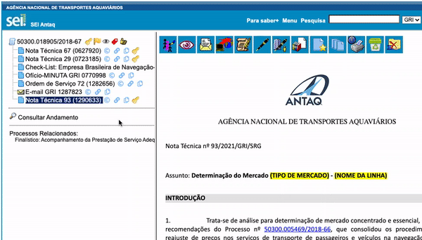

#  |  SEI Pro 

##  Duplicar documentos com 1 clique

Precisa de um documento igual a outro que já está no processo — um novo ofício no mesmo modelo, um despacho parecido? Em vez de criar do zero e copiar o texto, **clique em Duplicar**: o SEI Pro cria um novo documento do mesmo tipo, com o **mesmo texto** e as **mesmas informações** do original, e já abre o editor.

> 

### Como usar

1. Na árvore do processo, localize o documento que servirá de base;
2. Clique no ícone **Duplicar documento** ao lado dele (ou use a opção no [menu rápido do documento](../pages/MENURAPIDO.md));
3. Aguarde a mensagem *Duplicando...*;
4. O editor abre com a cópia. Faça as alterações e salve.

### O que é copiado

| Informação | Copiada? |
| ---------- | -------- |
| Texto do documento | Sim — o original é usado como "documento modelo" |
| Tipo de documento | Sim |
| Descrição | Sim |
| Interessados | Sim |
| Classificação por assuntos | Sim |
| Observações desta unidade | Sim |
| Nível de acesso | Sim |
| Assinaturas | **Não** — a cópia nasce sem assinatura |

### Como ativar

O ícone de duplicar faz parte dos [ícones rápidos na árvore](../pages/MENURAPIDO.md), que vêm ligados de fábrica pela opção **Menu rápido na árvore de documentos**.

### Bom saber

* Só é possível duplicar **documentos gerados no SEI** (os que abrem no editor). Documentos externos, como PDFs anexados, não podem ser duplicados.
* A cópia é criada **no mesmo processo** e registrada no andamento como um documento novo.
* Para abrir o editor numa aba nova, o navegador pode pedir permissão para **janelas pop-up** — autorize para o endereço do SEI.

## Próximo item

> [Enviar múltiplos documentos externos](../pages/UPLOADDOCS.md)
