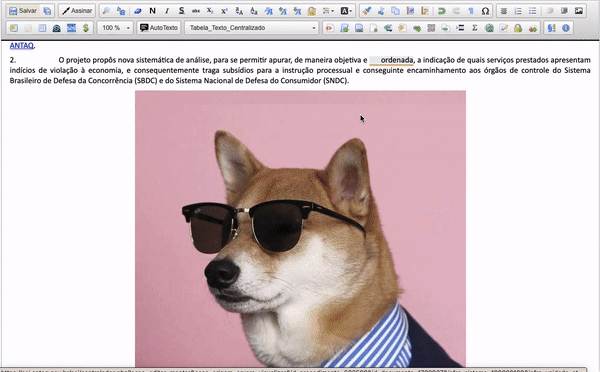
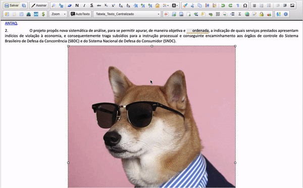

#  |  SEI Pro 

##  Enviar múltiplas imagens, formatar e editar opções avançadas

Essa ferramenta adiciona ao editor de texto SEI a possibilidade de enviar múltiplas imagens arrastando e soltando.

>  

Ainda, é possível formatar e editar as imagens a partir de opções avançadas.

>  

Ao clicar duas vezes sobre a imagem é possível ajustar os seguintes atributos

| **Atributos** | **Valores** |
| ------------------- | ------------------- |
| Largura | Número inteiro positivo (px ou %) |
| Altura | Número inteiro positivo (px ou %)  |
| Margem Vertical | Número inteiro positivo (px)  |
| Margem Horinzontal | Número inteiro positivo (px)  |
| Borda | Número inteiro positivo (px) |
| Largura Máxima | Número inteiro positivo (px ou %) |
| Altura Máxima | Número inteiro positivo (px ou %) |
| Alinhamento | <não ajustado> / Superior / Inferior / Esqueda / Direita |
| Qualidade da Imagem | 0-100 (somente antes do upload) |
| Filtro | <não ajustado> / Escala de cinza / Borrado / Caixa sombreada / Cores invertidas / Envelhecido |

Selecione a opção **Editar Imagem** (botão direito) para cortar, girar, inverter, desenhar, reparar, adicionar filtros, redimensionar e adicionar marca d'água na imagem.

>  

>  

>  

## Próximo item

> [Reduzir a qualidade das imagens inseridas nos documentos](../pages/QUALIDADEIMAGENS.md)
