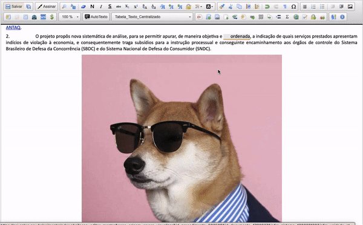
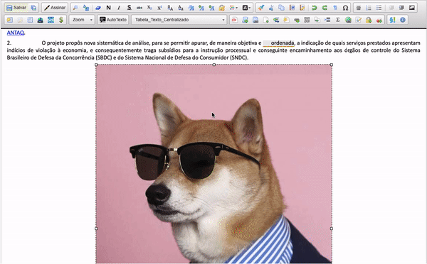

#  |  SEI Pro 

##  Enviar, formatar e editar imagens no editor

Coloque fotos e prints no documento **arrastando os arquivos para o editor**, ajuste tamanho, margens e alinhamento, e **edite a imagem ali mesmo** — recortar, girar, escrever, desfocar um dado, pôr marca d'água —, sem precisar de outro programa.

> 

### Enviar imagens

**Arraste** uma ou várias imagens do computador para dentro do texto. Elas entram no ponto onde você soltar.

> 

### Formatar a imagem

**Dê um duplo clique** na imagem (ou clique com o botão direito e escolha **Formatar Imagem**) para ajustar:

| Atributo | Valores |
| -------- | ------- |
| Largura e Altura | Em pixels ou porcentagem |
| Margem Vertical e Margem Horizontal | Em pixels |
| Borda | Espessura, em pixels |
| Largura Máxima e Altura Máxima | Em pixels ou porcentagem |
| Alinhamento | Não ajustado, superior, inferior, esquerda ou direita |
| Qualidade da Imagem | De 0 a 100 (somente antes de inserir) |
| Filtro | Não ajustado, escala de cinza, borrado, caixa sombreada, cores invertidas ou envelhecido |

### Editar a imagem

Clique com o **botão direito** na imagem e escolha **Editar Imagem**. Abre-se um editor completo, com as ferramentas:

* **Ajustar** — recortar, girar e espelhar;
* **Afinar** — brilho, contraste, saturação e outros ajustes;
* **Filtros**;
* **Anotar** — escrever textos, desenhar setas, retângulos e à mão livre;
* **Marca d'água**;
* **Redimensionar**.

Clique em **Aplicar** para substituir a imagem do documento pela editada, ou **Cancelar** para desistir.

> 

> 

> 

### No SEI 5

No editor do SEI 5, **clique na imagem**: na barra que aparece embaixo dela, os dois últimos botões são **Formatar imagem** e **Editar imagem**. Os dois também ficam no **botão direito** sobre a imagem. O duplo clique não abre a formatação no SEI 5.

O SEI 5 guarda a formatação de um jeito próprio:

* Na imagem **em linha com o texto** (o padrão ao colar ou inserir), valem todas as opções da tabela acima.
* Na imagem **centralizada em bloco** (opção *Quebrar texto* da barra da imagem), o SEI 5 guarda só o tamanho e o texto alternativo. Para usar margens, borda, filtro ou alinhamento, escolha antes *Texto ao redor* na barra da imagem.
* A qualidade é aplicada ao inserir uma imagem nova ou ao trocar a imagem, e não a cada nova formatação, para a imagem não perder qualidade a cada ajuste.

Para abrir o menu do navegador sobre uma imagem ou tabela (por exemplo, para copiar), use **Shift + botão direito**.

### Como ativar

A função vem **ligada** de fábrica. Ela fica nas [Configurações do SEI Pro](../pages/DESATIVARFUNCOES.md), aba **Geral**, seção **Editor de Texto**, opção **Envio, formatação e edição avançada de imagens no editor de documentos**.

### Bom saber

* A edição acontece **no seu computador**: a imagem não é enviada a nenhum serviço externo.
* **Para esconder um dado pessoal numa imagem**, desenhe um retângulo preto por cima com a ferramenta **Anotar** e clique em **Aplicar**: a imagem é regravada sem a informação.
* Imagens grandes deixam o documento pesado. Veja [Reduzir a qualidade das imagens](../pages/QUALIDADEIMAGENS.md).

## Próximo item

> [Redimensionar imagens](../pages/REDIMENSIONAIMG.md)
