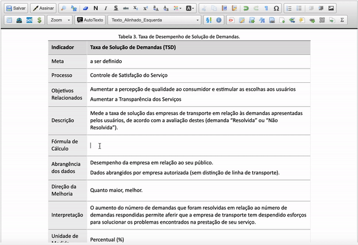

#  |  SEI Pro 

##  Inserir equações (fórmulas matemáticas)

Escreva **fórmulas matemáticas** — cálculo de reajuste, multa, índice, média ponderada — com a notação usada em trabalhos científicos, o **LaTeX**. A equação entra no documento como imagem, com aparência profissional.

> 

### Como usar

1. No editor, clique onde a equação deve entrar;
2. Clique no botão **Inserir Equação**;
3. Escreva a fórmula em LaTeX. A **pré-visualização** mostra o resultado enquanto você digita;
4. Clique em **Inserir**.

Exemplos:

| LaTeX | Resultado |
| ----- | --------- |
| `V_f = V_i \times (1 + i)^n` | Juros compostos |
| `\frac{a+b}{2}` | Fração |
| `\sum_{k=1}^{n} x_k` | Somatório |
| `\sqrt{x^2 + y^2}` | Raiz quadrada |

### Não conhece LaTeX?

* Monte a fórmula clicando em botões no [editor visual da CodeCogs](https://editor.codecogs.com/) e copie o código;
* Consulte o [guia de fórmulas TeX da Wikipédia](https://pt.wikipedia.org/wiki/Ajuda:Guia_de_edi%C3%A7%C3%A3o/F%C3%B3rmulas_TeX).

### Como ativar

O botão aparece sempre no editor do SEI quando o SEI Pro está instalado.

### Bom saber

* A imagem da equação é gerada pelo serviço **CodeCogs**, na internet: o texto da fórmula é enviado a ele. Depois de inserida, a imagem fica gravada no documento e não depende mais do serviço.
* Por ser imagem, a equação não pode ser editada como texto. Para alterar, apague e insira de novo.

## Próximo item

> [Gerar código QR (QR Code)](../pages/QRCODE.md)
