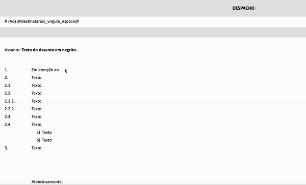
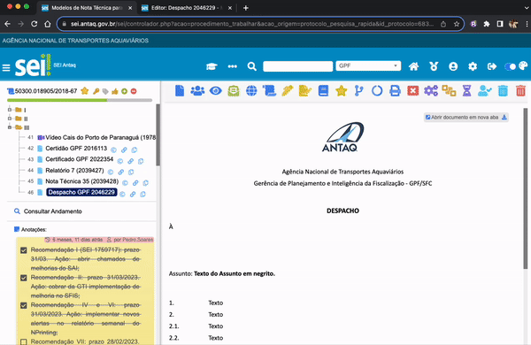

#  |  SEI Pro 

##  Escrita interativa no editor de documentos

Essa funcionalidade adiciona ao editor de documentos do SEI a possibilidade adicionar diversos dados do processo de maneira interativa, ao digitar o caractere **#**

> 

Digite **@** , seguido da sigla da uniade que se pretende enviar o processo, para adicionar a descrição completa da unidade.

Caso seja adicionada unidades pelo menu interativo (@) e o documento esteja visível na tela, 
os destinatários do documento serão automaticamente adicionados ao enviar o processo.

> 

## Próximo item

> [.](../pages/.md)

