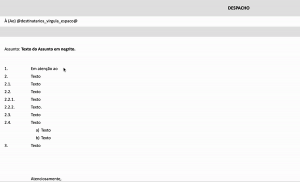
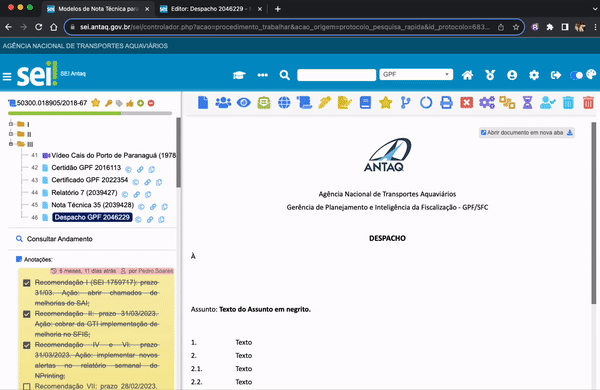

#  |  SEI Pro 

##  Escrita interativa no editor de documentos

Enquanto você escreve, **digite `#` ou `@`** e um menu aparece com sugestões para completar o texto — documentos e dados do processo, unidades e interessados —, sem sair do teclado.

> 

### Digite `#` para dados e documentos do processo

Ao digitar `#`, o menu lista:

* os **documentos do processo**, que entram como **citação com link** (no formato escolhido em [Referência de documentos](../pages/REFDOCUMENTOS.md));
* os **dados do processo** — número, tipo, interessados, assuntos e outros (veja [Dados do processo](../pages/DADOSPROCESSO.md)).

Continue digitando para filtrar a lista: `#desp` mostra os despachos.

### Digite `@` para unidades e interessados

Ao digitar `@` seguido da **sigla de uma unidade**, o menu sugere a **descrição completa** da unidade para inserir no texto.

> 

**Bônus:** as unidades inseridas com `@` são lembradas e, ao **enviar o processo** com o documento aberto na tela, elas **já aparecem preenchidas como destino** do envio.

### Navegar no menu

* `↑` e `↓` percorrem as sugestões;
* `Enter` ou `Tab` inserem a sugestão destacada;
* `Esc` fecha o menu;
* Continue digitando para refinar, ou apague o `#`/`@` para fechar.

O menu só abre quando o `#` ou o `@` **começa uma palavra**, logo depois de um espaço, de um parêntese ou no início do parágrafo. Por isso um e-mail (`fulano@orgao.gov.br`) ou um `#` colado no meio de uma palavra não abrem o menu.

### No SEI 5

No SEI 5 o editor já tem um menu próprio para o `@`, com as variáveis do SEI (`@ano@`, `@destinatarios_virgula_espaco@` e outras). O SEI Pro usa esse mesmo menu: as variáveis do SEI aparecem primeiro, seguidas das unidades encontradas. O `#` abre o mesmo menu com os documentos e dados do processo.

### Como ativar

A função vem **desligada** de fábrica. Para ligar, abra as [Configurações do SEI Pro](../pages/DESATIVARFUNCOES.md), aba **Geral**, seção **Editor de Texto**, e marque **Escrita interativa no editor de documentos (digite # ou @ para ativar menu rápido)**. Clique em **Salvar** e reabra o editor.

### Bom saber

* O menu usa os dados que o SEI Pro lê do processo. Com a opção [Desativar consultas adicionais](../pages/DESATIVACONSULTAS.md) ligada, as sugestões de `#` não aparecem.
* A sua própria unidade não aparece no `@`: a lista é a mesma que o SEI oferece como destino no **Enviar Processo**.
* Se você usa a [Legística](../pages/LEGISTICA.md), lembre que ela também usa `#` e `@` para referências cruzadas e externas.

## Próximo item

> [Salvar documentos automaticamente (temporariamente indisponível)](../pages/SALVAMENTOAUTOMATICO.md)
