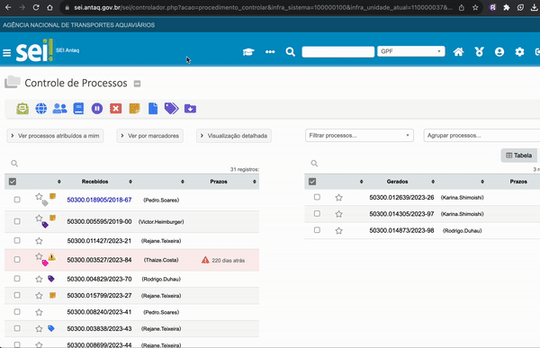

#  |  SEI Pro 

##  Mostrar especificação do processo na tabela de controle de processos

Essa funcionalidade de mostrar a especificação do processo na tabela de controle de processos.

> 

## Próximo item

> [.](../pages/.md)

