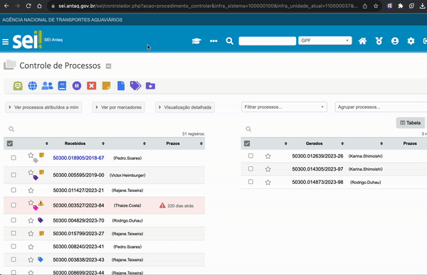

#  |  SEI Pro 

##  Mostrar especificação do processo na tabela de controle de processos

No SEI, a especificação de um processo (o "assunto" digitado ao criá-lo) só aparece quando você passa o mouse sobre o número. Com esta função, **a especificação fica escrita logo acima do número do processo**, na própria tabela — dá para identificar cada processo de relance.

> 

### Como ativar

A função vem **desligada** de fábrica. Para ligar, abra as [Configurações do SEI Pro](../pages/DESATIVARFUNCOES.md), aba **Geral**, seção **Controle de Processos**, e marque **Mostrar especificação do processo na tabela de controle de processos**. Clique em **Salvar** e recarregue o SEI.

### Bom saber

* A especificação só aparece quando a lista está **sem agrupamento**. Ao escolher um agrupamento em [Agrupar lista de processos](../pages/AGRUPAR.md), ela é recolhida para os grupos ficarem compactos.
* Processos sem especificação continuam mostrando só o número.
* Textos longos quebram em várias linhas e deixam a tabela mais alta. Se preferir uma lista mais enxuta, deixe a função desligada e use o tooltip do SEI.

## Próximo item

> [Mostrar nomes de usuários na tabela](../pages/NOMESUSUARIOS.md)
