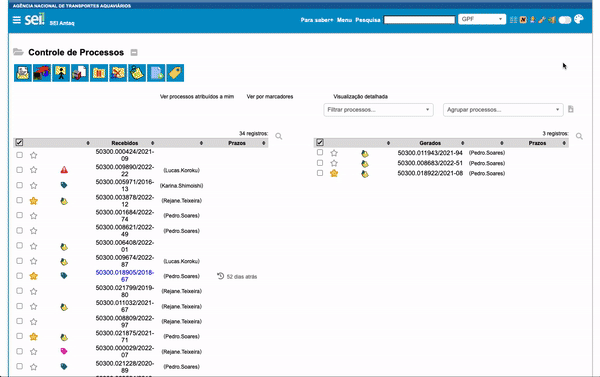

#  |  SEI Pro 

##  Alterar o layout do SEI (Estilo Avançado e Modo Noturno)

Dê ao SEI a **sua cara**: escolha a **cor principal** do sistema, ative o **modo noturno** para descansar a vista, coloque **legendas nos ícones** e deixe a **barra de botões do processo na vertical**.

> 

### Como ativar o Estilo Avançado

No canto superior direito do SEI, ao lado dos ícones do sistema, aparecem dois controles do SEI Pro:

* uma **chave** — clique para **ligar ou desligar** o Estilo Avançado;
* um ícone de **paleta** — clique para abrir as **opções de estilo**.

### As opções

| Opção | O que faz |
| ----- | --------- |
| **Cor Principal do Layout** | Escolha uma das cores prontas para o cabeçalho, botões e destaques |
| **Cor personalizada** | Escolha qualquer outra cor |
| **Modo noturno** | Fundo escuro e letras claras, para ambientes com pouca luz |
| **Ícones com legenda** | Mostra o nome de cada botão abaixo do ícone — ótimo para quem ainda está aprendendo o SEI |
| **Barra de Botões na Vertical** | Coloca os botões do processo numa coluna ao lado, liberando espaço em telas largas |

Com o Estilo Avançado ligado, um ícone de **lua/casa** no cabeçalho permite **ligar e desligar o modo noturno** com um clique.

### No editor de documentos

O editor também tem um botão **Ativar estilo avançado**, que aplica o visual moderno à barra de ferramentas e à área de edição.

### Bom saber

* O estilo é **pessoal** e fica guardado **neste navegador**: não muda nada para os outros usuários, nem nos documentos.
* O modo noturno muda só a tela. Documentos impressos e PDFs continuam com fundo branco.
* Com o Estilo Avançado ligado, a divisória entre a árvore e o documento pode ser **arrastada** para ajustar a largura — veja [Redimensionar a árvore](../pages/RESIZEARVORE.md).

## Próximo item

> [Menu Suspenso](../pages/MENUSUSPENSO.md)
