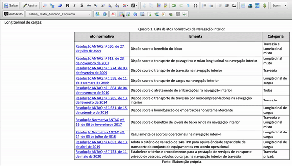

#  |  SEI Pro 

##  Adicionar estilo à tabela e outras ações com tabelas

Deixe as tabelas dos seus documentos mais legíveis: aplique **cores**, **linhas zebradas** e **cabeçalho destacado** com poucos cliques. Pelo botão direito do mouse, o SEI Pro também permite **duplicar** e **ordenar** tabelas.

> 

### Aplicar um estilo

1. Clique em qualquer célula da tabela;
2. Na barra do editor, clique em **Adicionar estilo à tabela** (pincel);
3. Escolha:
   * a **variação de cores**;
   * o **estilo** da tabela;
   * a **largura** da tabela, em porcentagem da página;
   * se a **primeira linha deve ser o cabeçalho** da tabela;
4. Clique em **Aplicar**.

### Menu do botão direito

Clique com o **botão direito** dentro de uma tabela para ver:

| Opção | O que faz |
| ----- | --------- |
| **Adicionar Estilo** | Abre a mesma janela de estilos |
| **Duplicar Tabela** | Cria uma cópia da tabela logo abaixo |
| **Classificar A → Z** | Ordena as linhas pela coluna clicada, em ordem crescente |
| **Classificar Z → A** | Ordena as linhas pela coluna clicada, em ordem decrescente |

### Como ativar

O botão e as opções do menu aparecem sempre no editor do SEI quando o SEI Pro está instalado.

### Bom saber

* O estilo é gravado no próprio documento e aparece para todos, com ou sem o SEI Pro, inclusive na impressão e no PDF.
* Ao classificar, confira se a linha de cabeçalho ficou no lugar.
* Para criar a tabela, veja [Tabela rápida](../pages/TABELARAPIDA.md).

## Próximo item

> [Tabela rápida](../pages/TABELARAPIDA.md)
