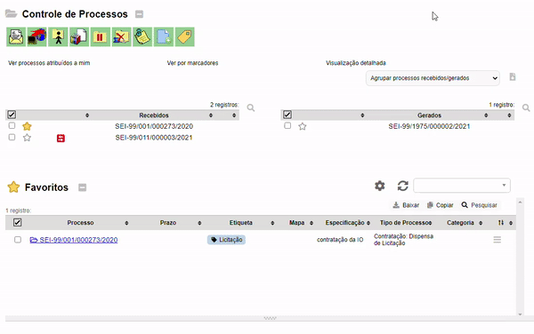
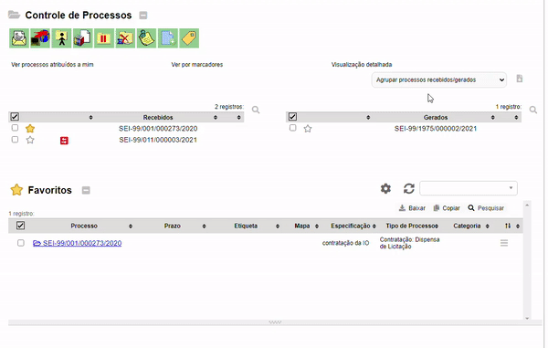
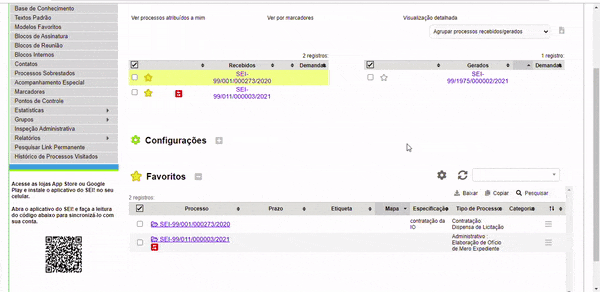
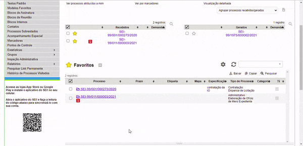
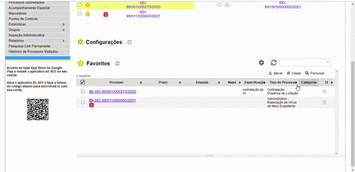

#  |  SEI Pro 

##  Gerenciar processos favoritos

Essa funcionalidade adiciona à página inicial do SEI um gestor de processos favoritos, exclusivo do usuário.

>  

Para que você possa favoritar seus processos.

## 1. Adicionando Etiquetas

Essa funcionalidade adiciona ao processo favorito uma etiqueta.

>  

## 2. Adicionando Mapas

Essa funcionalidade adiciona uma localização no mapa do processo.

>  

## 3. Editando uma Descrição

Siga o passo a passo para [Editar uma descrição de um processo favorito](../pages/FAVORITOS-DESCRICAO.md)

## 4. Movendo a Ordem dos Favoritos

Essa funcionalidade altera a ordem do processo favorito

>  

## 5. Classificando a Tabela

Siga o passo a passo para [Classificar uma Tabela](../pages/FAVORITOS-TABELA.md)
 
## 6. Criando Categorias

Essa funcionalidade adiciona uma categoria ao processo favorito

>  

## 7. Configurações: exportar e importar

- [Exportar ](../pages/FAVORITOS-EXPORTAR.md)
- [Importar ](../pages/FAVORITOS-IMPORTAR.md)

## Próximo item

> [Agrupar lista de processos por marcadores, tipo, responsável ou ponto de controle](../pages/AGRUPAR.md)
