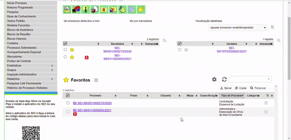
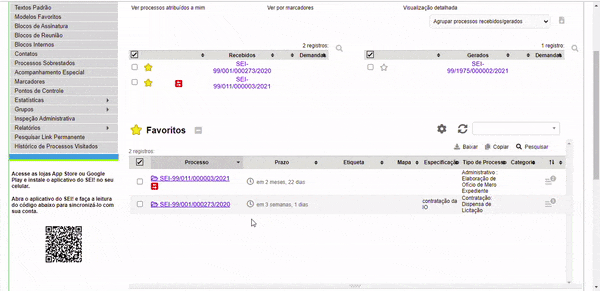
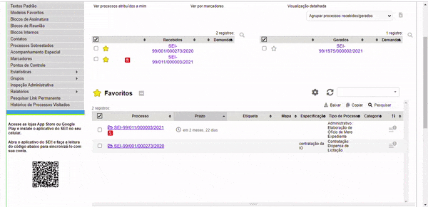
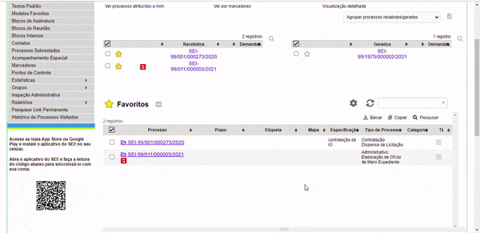
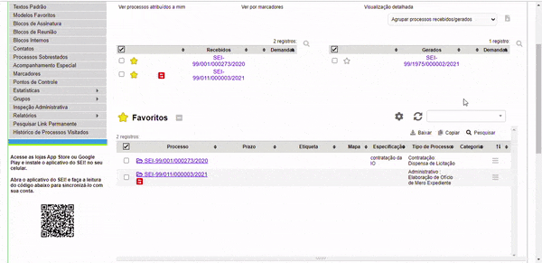

#  |  SEI Pro 

##  Gerenciar processos favoritos

Essa funcionalidade adiciona à página inicial do SEI um gestor de processos favoritos, exclusivo do usuário.

>  

Para que você possa favoritar seus processos.

## 1. Adicionando Etiquetas

Essa funcionalidade adiciona ao processo favorito uma etiqueta, podendo ser personalizada com cores e ícones.

>  

## 2. Adicionando Mapas

Essa funcionalidade adicionar e editar uma localização no mapa atravez do marcador ou fazendo uma busca por um lugar consolidade especifico.  

>  

## 3. Editando uma Especificação

Essa funcionalidade adiciona e ou altera uma especificação.  

>  

## 4. Classificando a Tabela e Movendo a Ordem dos Favoritos

São duas funcionalidades uma delas altera a ordem do processo favorito e a outra classificando a Tabela.

>  

## 5. Adicionando Prazo ao Processo

Essa funcionalidade adiciona um prazo com uma data especifica ao processo.

>  

- [Edição Avançada] Essa funcionalidade permite uma edição avançada com várias funções tais como: Contar o tempo decorrido do processo a partir: Da data de assinatura de um documento, De uma data específica,Data referencial; Visualizar o resultado: Em tempo relativo, Em número de dias. Sinalizar a partir: Da assinatura de um novo documento. 

>  
 
## 6. Criando Categorias

Essa funcionalidade adiciona uma categoria ao processo favorito.

>  

## 7. Configurações: exportar e importar

- [Exportar] Essa funcionalidade exporta os processos favoritos selecionados pelo usuário.

>  

- [Importar] Essa funcionalidade importa os processos favoritos selecionados pelo usuário.

>  
 

## Próximo item

> [Agrupar lista de processos por marcadores, tipo, responsável ou ponto de controle](../pages/AGRUPAR.md)
